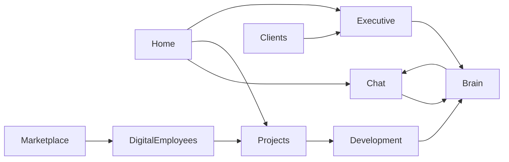

# Genesis OS — Architecture v1

**Версия:** 1.0  
**Дата:** 2026-07-04  
**Статус:** 📐 ARCHITECTURE ONLY — не код, не реализация  
**Контекст:** Genesis Desktop перестаёт быть «приложением» и становится **рабочим местом CEO** — операционной системой компании.

---

## 1. Что такое Genesis OS

**Genesis OS** — не замена Windows. Это слой, в котором компания **живёт и работает**:

* видит состояние бизнеса;
* принимает решения;
* ведёт проекты;
* помнит, почему решила именно так;
* развивает продукты — включая сам Genesis.

**Финальный критерий (горизонт ~1 год):**

> Открываю только Genesis. Браузер, Cursor, GitHub, Railway, почта — вторичны.

**Правило, которое никогда не снимаем:**

```
AI предлагает план
        ↓
CEO подтверждает
        ↓
Только потом — изменения (код, деплой, деньги)
```

---

## 2. Основные разделы Desktop (горизонт 5 лет)

Каждый раздел — **реальная функция**, не пустой экран. Порядок в сайдбаре может меняться; логика — нет.

| Раздел | Роль | Когда строим |
|--------|------|--------------|
| **Home** | Утренний брифинг CEO: инфра, проекты, доход, уведомления | Stage 2.5 ✅ |
| **Chat** | Диалог с Genesis; быстрые команды; позже — голос | Stage 2.5 ✅ |
| **Projects** | Рабочие проекты клиентов и внутренние (factory) | Stage 2.5 ✅ |
| **Company Brain** | Журнал решений, память компании, контекст | **Stage 3** |
| **Development Studio** | Planner → Code → Build → Tests → Git → Deploy | **Stage 4** |
| **Executive** | Рекомендации, approvals, CEO gate | Stage 5 |
| **Clients** | CRM-light: кто ждёт ответа, сделки, история | Stage 5–6 |
| **Knowledge** | Документы, runbooks, политики (не сырой чат) | Stage 3+ |
| **Marketplace** | Каталог цифровых возможностей / сотрудников | Stage 6 |
| **Digital Employees** | Sales, Dev, Marketing… как модули | Stage 6–7 |
| **Settings** | Аккаунт, API, тема, обновления | Stage 2 ✅ |

**Скрытый режим (позже):** `Build Genesis` — Development Studio, нацеленная на **сам репозиторий Genesis**. Сначала — другие проекты; потом — self-improvement.

---

## 3. Ядро системы

```
┌─────────────────────────────────────────────────────────┐
│                    Genesis Kernel                        │
│  API (Railway) · Auth · Events · Queue · Audit          │
└──────────────────────────┬──────────────────────────────┘
                           │
        ┌──────────────────┼──────────────────┐
        ▼                  ▼                  ▼
  Company Brain      Project Graph      Policy Engine
  (память, решения)  (проекты, файлы)  (plan → approve)
        │                  │                  │
        └──────────────────┼──────────────────┘
                           ▼
              Genesis Desktop (Tauri + React)
                           │
     Home · Chat · Projects · Brain · Dev · Executive …
```

**Ядро — не UI.** Ядро — это:

1. **Genesis API** — единый источник правды о состоянии компании.
2. **Company Brain** — долговременная память (решения, клиенты, уроки).
3. **Policy Engine** — gate: никаких необратимых действий без CEO.
4. **Event Bus** — всё важное пишется в журнал (audit, timeline, notifications).

Desktop — **тонкий, но умный клиент**: показывает, запрашивает подтверждение, кэширует офлайн-настройки.

---

## 4. Общие данные (shared across modules)

| Сущность | Кто пишет | Кто читает |
|----------|-----------|------------|
| **Owner session** | Auth / Connect | Все разделы |
| **Projects** | Factory, Development | Home, Projects, Executive |
| **Decisions** | CEO, Brain | Brain, Executive, Development |
| **Notifications** | API, queue, sales | Home, Executive |
| **Chat threads** | Chat, Employees | Chat, Brain (summary) |
| **Deployments** | Dev Studio, CI | Home, Projects, Executive |
| **Clients & orders** | Sales, website | Clients, Executive, Home |
| **Knowledge docs** | CEO, Brain | Knowledge, Development, Chat |

**Принцип:** один раз записали в Brain — все модули видят контекст (с правами).

---

## 5. Как разделы взаимодействуют



**Типовые потоки:**

1. **Утро:** Home загружает API + modules + notifications → Executive предлагает 3 действия.
2. **Проект:** Projects → открыть → Development Studio → план → CEO OK → build → deploy → запись в Brain.
3. **Клиент:** Clients → «ожидает ответа» → Chat с контекстом из Brain → ответ → лог решения.
4. **Build Genesis:** Development Studio в режиме `genesis-ai-engine` repo → тот же plan/approve pipeline.

---

## 6. Company Brain (Stage 3) — связующее звено

Brain — **не чат-история**. Это структурированная память:

```text
Решение: Выбрали Tauri 2
├── Почему: малый размер, Windows-first, Rust backend
├── Альтернативы: Electron (тяжёлый), Flutter (другой UI)
├── Кто: CEO + Architect
├── Когда: 2026-07
├── Последствия: нужен Rust toolchain для native build
└── Связанные проекты: Genesis Desktop
```

**Brain связывает:**

| Модуль | Что даёт Brain |
|--------|----------------|
| **Development** | Контекст проекта, прошлые ошибки, стандарты |
| **Executive** | Почему мы так решили; что нельзя ломать |
| **Projects** | История статусов, handoff, клиентские договорённости |
| **Marketplace** | Что уже пробовали; что сработало у других BU |
| **Chat** | RAG поверх Brain, не голый LLM |

---

## 7. Development Studio (Stage 4)

**Не Cursor.** Собственный слой Genesis:

```
Development Studio
├── AI Planner      — анализ, план, список файлов, риски
├── Code Workspace  — просмотр/редактирование (или внешний editor bridge)
├── AI Reviewer     — diff, security, style
├── Build           — npm/cargo/tauri
├── Tests           — unit, smoke
├── Git             — branch, commit (с approve)
└── Deploy          — Railway / Vercel (с approve)
```

**Pipeline (обязательный):**

```
Запрос → Анализ репозитория → План (файлы, время, риски)
        → CEO: «Начать?» → Да → Изменения → Build → Tests
        → Показать diff → CEO: «Commit / Deploy?»
```

**Фазы:**

| Фаза | Scope |
|------|--------|
| 4a | Read-only: анализ + план + diff preview |
| 4b | Approve → apply patch локально |
| 4c | Build + test в sandbox |
| 4d | Git + deploy с gate |
| 4e | **Build Genesis** — тот же pipeline на `Genesis-AI-Engine` |

Модели AI — **сменяемые** (OpenAI, Anthropic, local). Genesis не зависит от одного вендора.

---

## 8. Executive (Stage 5)

Не дашборд ради цифр. **Режим решений:**

* что требует ответа сегодня;
* что заблокировано (Gewerbe, Stripe, deploy);
* что рекомендует Genesis (с обоснованием из Brain);
* одна кнопка: approve / defer / reject.

Связь с Mission 1: первый клиент, live €, outreach — всё видно здесь.

---

## 9. Marketplace & Digital Employees (Stage 6–7)

**Marketplace** — не магазин APK. Библиотека **цифровых возможностей**:

> «Мне нужен цифровой бухгалтер» → 3 варианта с evidence level.

**Digital Employees** — модули с ролью (Sales, Dev, Marketing).  
**Digital Departments** — команды сотрудников с общей очередью.

Оба читают Brain и Policy Engine. Ни один не пишет в production без gate.

---

## 10. Дорожная карта (согласовано с CEO)

```
Stage 2     Genesis Desktop v1          ✅ commit
Stage 2.5   Daily Driver (70–80%)       🔄 commit, no push
Stage 3     Company Brain v1            📐 architecture
Stage 4     Development Studio          📐 architecture
Stage 5     Executive v1
Stage 6     Marketplace v1
Stage 7     Digital Employees v1
Stage 8     Digital Departments
Stage 9     macOS / Linux / mobile
```

**Не перескакивать.** Brain до Dev Studio — иначе AI будет менять код без памяти компании.

---

## 11. Две компании — одна платформа

| Genesis Company | Genesis Platform |
|-----------------|------------------|
| Сайт, услуги, Mission 1 | Desktop, Brain, Dev Studio |
| Зарабатывает сейчас | Становится продуктом позже |
| Публичный сайт (RC2) | Client (не push до Daily Driver gate) |

Публичный web и Desktop **делят API**, не дублируют бизнес-логику.

---

## 12. Риски (честно)

| Риск | Митигация |
|------|-----------|
| Перегрузить UI вкладками | Command Palette + только активные модули |
| Dev Studio = второй Cursor | Фокус на plan/approve + Genesis API, не на editor wars |
| Brain раздувается | Структурированные записи, не весь чат |
| Зависимость от AI API | Абстракция моделей; локальный fallback позже |
| Self-modify Genesis ломает prod | Отдельный gate; branch; never auto-push main |

---

## 13. Следующий шаг (после Stage 2.5 gate)

1. CEO: Rust + daily use → push Desktop.
2. Спецификация **Company Brain schema v1** (типы записей, API).
3. Development Studio **4a** — read-only planner на одном внешнем проекте.

---

*Genesis OS v1 — живой документ. Меняется только при серьёзном архитектурном блокере. Код следует архитектуре, не наоборот.*

**Связанные документы:**

* `client/docs/ROADMAP.md`
* `client/docs/STAGE2_5_DAILY_DRIVER.md`
* `dashboard/Genesis_Development_Policy.md`
* `dashboard/Genesis_Client_Foundation.md`
