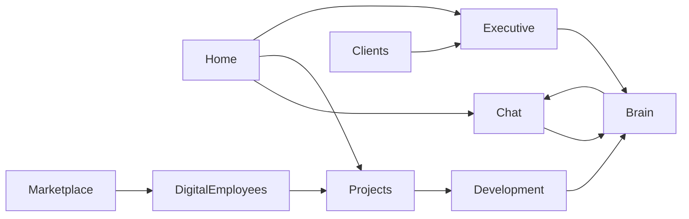

# Genesis OS — Architecture v1

**Версия:** 1.1  
**Дата:** 2026-07-04  
**Статус:** 📐 ARCHITECTURE + PHILOSOPHY — не код Brain / Executive / Marketplace до Daily Driver gate  
**Сдвиг:** Genesis — не «программа». Это **Company OS** — операционная система компании.

---

## 1. Что такое Genesis OS (Company OS)

**Genesis OS** — не Windows и не Linux. Это система, **через которую компания живёт**:

* проекты, клиенты, переписка, задачи;
* деплои, документы, идеи, решения;
* уведомления; финансы (позже); разработка.

**Финальный критерий (горизонт ~1 год):**

> Утром открываю Genesis. Десять других сервисов — не нужны.

**Сейчас (Stage 2.5):** проверяем это на **Genesis Company** — dogfood до того, как предлагать клиентам.

---

## 1.1 Главный принцип Genesis — Plan → Approve → Act

Не только для кода. **Для всей компании.**

| Область | План | Подтверждение | Действие |
|---------|------|---------------|----------|
| **Разработка** | Список файлов, риски | CEO | Изменить код |
| **Deploy** | Что уйдёт в prod | CEO | Deploy |
| **Продажи** | Текст письма / оффер | CEO | Отправить |
| **Проект** | Изменение scope | CEO | Применить |
| **Деньги** | Платёж, refund | CEO | Выполнить |

```
Genesis предлагает
        ↓
CEO подтверждает (или отклоняет)
        ↓
Только потом — необратимое действие
```

Это делает систему **безопасной**. Policy Engine в ядре — техническая реализация этого принципа.

---

## 1.2 Принцип dogfood

> **Любая новая возможность должна быть полезна Genesis Company до того, как её предложат клиентам.**

Если функция не помогает **нашей** компании работать лучше — спросить: нужна ли она клиентам?

Genesis развивается, **работая на себя** → проверенное отдаётся другим.

**Следствие сейчас:** не писать код Company Brain, Executive, Marketplace. Сначала — **ежедневный Desktop** и журнал трения (`Daily_Driver_Journal.md`).

---

## 1.3 Genesis Laws — пять законов (FROZEN v1.1)

Полный текст: `Genesis_Laws.md` · **не плодить новые Laws** без серьёзной причины.

| # | Закон | Суть |
|---|-------|------|
| **№1** | Plan → Approve → Act | Критичные действия только после CEO |
| **№2** | One Window | Рабочий день начинается в Genesis |
| **№3** | Dogfood First | Сначала Genesis Company, потом клиенты |
| **№4** | Evidence Before Automation | Сначала ручная проверка, потом Studio |
| **№5** | Human Accountability | Genesis советует; CEO отвечает |

**Принципы (не Laws):** Company OS · Experience > Knowledge · время CEO.

**Фильтр:** соответствует ли новая функция всем пяти законам?

---

## 2. Основные разделы Desktop (горизонт 5 лет)

Каждый раздел — **реальная функция**, не пустой экран. Порядок в сайдбаре может меняться; логика — нет.

| Раздел | Роль | Когда строим |
|--------|------|--------------|
| **Home** | Утренний брифинг CEO: инфра, проекты, доход, уведомления | Stage 2.5 ✅ |
| **Chat** | Диалог с Genesis; быстрые команды; позже — голос | Stage 2.5 ✅ |
| **Projects** | Рабочие проекты клиентов и внутренние (factory) | Stage 2.5 ✅ |
| **Company Brain** | Журнал решений, память компании, контекст | **Stage 3** |
| **Development Studio** | Planner → Code → Build → Tests → Git → Deploy | **Stage 4** |
| **Studios** (семейство) | Design · Marketing · Content · Analytics — та же основа | Stage 5+ |
| **Executive** | Рекомендации, approvals, CEO gate | Stage 5 |
| **Clients** | CRM-light: кто ждёт ответа, сделки, история | Stage 5–6 |
| **Knowledge** | Документы, runbooks, политики (не сырой чат) | Stage 3+ |
| **Marketplace** | Каталог цифровых возможностей / сотрудников | Stage 6 |
| **Digital Employees** | Sales, Dev, Marketing… как модули | Stage 6–7 |
| **Settings** | Аккаунт, API, тема, обновления | Stage 2 ✅ |

**Скрытый режим (позже):** `Build Genesis` — Development Studio, нацеленная на **сам репозиторий Genesis**. Сначала — другие проекты; потом — self-improvement.

---

## 3. Ядро системы

```
┌─────────────────────────────────────────────────────────┐
│                    Genesis Kernel                        │
│  API (Railway) · Auth · Events · Queue · Audit          │
└──────────────────────────┬──────────────────────────────┘
                           │
        ┌──────────────────┼──────────────────┐
        ▼                  ▼                  ▼
  Company Brain      Project Graph      Policy Engine
  (память, решения)  (проекты, файлы)  (plan → approve)
        │                  │                  │
        └──────────────────┼──────────────────┘
                           ▼
              Genesis Desktop (Tauri + React)
                           │
     Home · Chat · Projects · Brain · Dev · Executive …
```

**Ядро — не UI.** Ядро — это:

1. **Genesis API** — единый источник правды о состоянии компании.
2. **Company Brain** — долговременная память (решения, клиенты, уроки).
3. **Policy Engine** — gate: никаких необратимых действий без CEO.
4. **Event Bus** — всё важное пишется в журнал (audit, timeline, notifications).

Desktop — **тонкий, но умный клиент**: показывает, запрашивает подтверждение, кэширует офлайн-настройки.

---

## 4. Общие данные (shared across modules)

| Сущность | Кто пишет | Кто читает |
|----------|-----------|------------|
| **Owner session** | Auth / Connect | Все разделы |
| **Projects** | Factory, Development | Home, Projects, Executive |
| **Decisions** | CEO, Brain | Brain, Executive, Development |
| **Notifications** | API, queue, sales | Home, Executive |
| **Chat threads** | Chat, Employees | Chat, Brain (summary) |
| **Deployments** | Dev Studio, CI | Home, Projects, Executive |
| **Clients & orders** | Sales, website | Clients, Executive, Home |
| **Knowledge docs** | CEO, Brain | Knowledge, Development, Chat |

**Принцип:** один раз записали в Brain — все модули видят контекст (с правами).

---

## 5. Как разделы взаимодействуют



**Типовые потоки:**

1. **Утро:** Home загружает API + modules + notifications → Executive предлагает 3 действия.
2. **Проект:** Projects → открыть → Development Studio → план → CEO OK → build → deploy → запись в Brain.
3. **Клиент:** Clients → «ожидает ответа» → Chat с контекстом из Brain → ответ → лог решения.
4. **Build Genesis:** Development Studio в режиме `genesis-ai-engine` repo → тот же plan/approve pipeline.

---

## 6. Company Brain (Stage 3) — три уровня памяти

Brain — **не чат-история**. Три разных слоя:

### 6.1 Knowledge — что известно

Факты, документы, runbooks, контекст проектов.

### 6.2 Decisions — почему принято

```text
Решение: Выбрали Tauri 2
├── Почему: малый размер, Windows-first
├── Альтернативы: Electron, Flutter
├── Кто: CEO + Architect
├── Когда: 2026-07
└── Связанные проекты: Genesis Desktop
```

### 6.3 Experience — что получилось после

Исход решения: сработало / не сработало / урок.  
Именно **Experience** учит Genesis на **результатах**, не только на информации.

**Gate:** код Brain — **только после** Daily Driver (CEO открывает Desktop каждый день).

| Модуль | Что даёт Brain |
|--------|----------------|
| **Development** | Контекст проекта, прошлые ошибки, стандарты |
| **Executive** | Почему мы так решили; что нельзя ломать |
| **Projects** | История статусов, handoff, клиентские договорённости |
| **Marketplace** | Что уже пробовали; что сработало у других BU |
| **Chat** | RAG поверх Brain, не голый LLM |

---

## 7. Studios (Stage 4+) — одна основа, разные режимы

Со временем не один Development Studio, а **Studios**:

| Studio | Назначение |
|--------|------------|
| 💼 **Sales** | Лиды, анализ сайта, КП, цена, договор — отправка после CEO | Stage 4+ (dogfood Mission 1) |
| 💻 **Development** | Код, build, tests, git, deploy |
| 🎨 **Design** | UI, бренд, макеты |
| 📈 **Marketing** | Кампании, outreach, контент-план |
| ✍️ **Content** | Тексты, legal, документация |
| 📊 **Analytics** | Метрики, отчёты, evidence |

Общее: **Plan → Approve → Act**, Company Brain, Policy Engine.  
Не Cursor — **собственный слой Genesis**, сменяемые AI-модели.

### 7.1 Development Studio (первый Studio)

```
Development Studio
├── AI Planner      — анализ, план, список файлов, риски
├── Code Workspace  — просмотр/редактирование (или внешний editor bridge)
├── AI Reviewer     — diff, security, style
├── Build           — npm/cargo/tauri
├── Tests           — unit, smoke
├── Git             — branch, commit (с approve)
└── Deploy          — Railway / Vercel (с approve)
```

**Pipeline (обязательный):**

```
Запрос → Анализ репозитория → План (файлы, время, риски)
        → CEO: «Начать?» → Да → Изменения → Build → Tests
        → Показать diff → CEO: «Commit / Deploy?»
```

**Фазы:**

| Фаза | Scope |
|------|--------|
| 4a | Read-only: анализ + план + diff preview |
| 4b | Approve → apply patch локально |
| 4c | Build + test в sandbox |
| 4d | Git + deploy с gate |
| 4e | **Build Genesis** — тот же pipeline на `Genesis-AI-Engine` |

Модели AI — **сменяемые** (OpenAI, Anthropic, local). Genesis не зависит от одного вендора.

---

## 8. Executive (Stage 5)

Не дашборд ради цифр. **Режим решений:**

* что требует ответа сегодня;
* что заблокировано (Gewerbe, Stripe, deploy);
* что рекомендует Genesis (с обоснованием из Brain);
* одна кнопка: approve / defer / reject.

Связь с Mission 1: первый клиент, live €, outreach — всё видно здесь.

---

## 9. Marketplace & Digital Employees (Stage 6–7)

**Marketplace** — не магазин APK. Библиотека **цифровых возможностей**:

> «Мне нужен цифровой бухгалтер» → 3 варианта с evidence level.

**Digital Employees** — модули с ролью (Sales, Dev, Marketing).  
**Digital Departments** — команды сотрудников с общей очередью.

Оба читают Brain и Policy Engine. Ни один не пишет в production без gate.

---

## 10. Дорожная карта

```
Stage 2     Genesis Desktop v1          ✅
Stage 2.5   Daily Driver (70–80%)       ✅ commit · journal · no push
            ↳ CEO использует каждый день · записывает трение
Stage 3     Company Brain v1            📐 после gate 2.5
Stage 4     Development Studio          📐
Stage 5     Executive + Studios expand
Stage 6     Marketplace v1
Stage 7     Digital Employees
Stage 8     Digital Departments
Stage 9     macOS / Linux / mobile
```

**Сейчас не кодить:** Brain, Executive, Marketplace.  
**Сейчас кодить:** только то, что мешает **ежедневному** Desktop.

---

## 11. Две компании — одна платформа

| Genesis Company | Genesis Platform |
|-----------------|------------------|
| Сайт, услуги, Mission 1 | Desktop, Brain, Dev Studio |
| Зарабатывает сейчас | Становится продуктом позже |
| Публичный сайт (RC2) | Client (не push до Daily Driver gate) |

Публичный web и Desktop **делят API**, не дублируют бизнес-логику.

---

## 12. Риски (честно)

| Риск | Митигация |
|------|-----------|
| Перегрузить UI вкладками | Command Palette + только активные модули |
| Dev Studio = второй Cursor | Фокус на plan/approve + Genesis API, не на editor wars |
| Brain раздувается | Структурированные записи, не весь чат |
| Зависимость от AI API | Абстракция моделей; локальный fallback позже |
| Self-modify Genesis ломает prod | Отдельный gate; branch; never auto-push main |

---

## 13. Следующий шаг — план CEO (не код платформы)

1. **Каждый день** — `client/desktop` (`npm run dev` или `tauri dev` после Rust).
2. **Записывать** в `Daily_Driver_Journal.md` — что неудобно, чего не хватает.
3. **Довести** до «основной рабочий инструмент» (70–80% без браузера).
4. **Тогда** — push Desktop + спецификация Brain schema v1.

Параллельно: Mission 1 (Gewerbe → Stripe Live → первый клиент).

---

*Genesis OS v1 — живой документ. Меняется только при серьёзном архитектурном блокере. Код следует архитектуре, не наоборот.*

**См. также:** `Genesis_Laws.md` · `Genesis_Company_OS_Maturity_v1.md` · `Daily_Driver_Journal.md`
