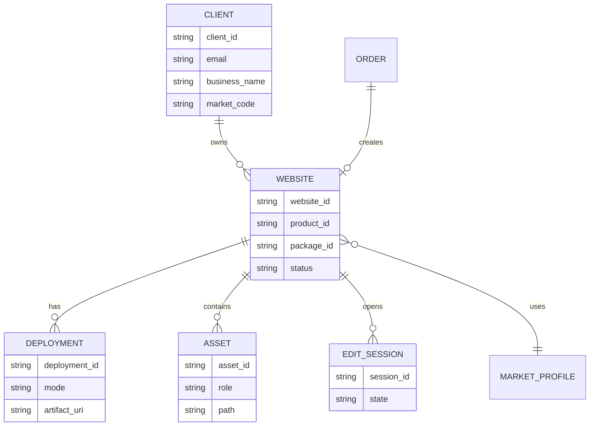
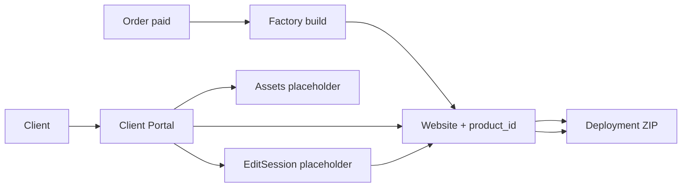

# Commercial Validation

**Rule:** Новые крупные функции добавляются только тогда, когда они решают проблему, подтверждённую реальными пользователями или аналитикой.

**Status:** ACTIVE (2026-07-21)  
**Mode:** market proof — not feature building  
**Prior mission:** Mission 2 — **COMPLETE**

## Roadmap

| Stage | Theme | Status |
|-------|--------|--------|
| Mission 0 | Foundation | ✅ |
| Mission 1 | Public Launch | ✅ |
| Mission 2 | Factory + Order Experience | ✅ |
| **Commercial Validation** | Market proof | **ACTIVE** (parallel) |
| **Mission 3** | Perception → semantics → market → portal | **OPEN** |
| Mission 4 | Premium Workspace | Later |
| Mission 5 | Platform Expansion | Later |

## Mission 3 — REORDERED (2026-07-21, CEO)

**Why opened early:** Visual Product Audit + 3-second Premium Test = **FAIL** (then improved).  
**Why reordered again:** Niche sweep (8 niches) proved Media Intelligence is size/aspect only —  
Beauty / Computer / Green heroes off-topic. Systemic algorithm gap, not dental-only.

| Slice | Theme | Status |
|-------|--------|--------|
| **R3.1** | **Premium Visual System** | **✅ PASS** (CEO 2026-07-22) |
| **R3.2** | **Section-Aware Media Gate** | **✅ PASS** (CEO 2026-07-22) |
| **R3.2.1** | **UX Polish** (back-to-top · overflow) | **✅ PASS** (CEO 2026-07-22) |
| ✅ **R3.3** | **Section-Aware Content Gate** | **PASS** (CEO 2026-07-22) |
| ✅ **R3.4** | **Global Market** | **CLOSED** (CEO 2026-07-22) |
| → R3.4.1 | Market Profile (SSOT) | PASS · `fb99cbe` |
| → R3.4.1.R | Regression Cleanup | PASS · `e3aa8d7` |
| → R3.4.2.1 | Market Registry | PASS · `abb300d` |
| → R3.4.2.2 | Factory Consumers | PASS · `a675c60` |
| → R3.4.2.3 | Market Expansion Validation | PASS · `9756c84` |
| **R3.5** | **Client Portal** | **OPEN** |
| → ✅ **R3.5.1** | **Client Portal Architecture** | **PASS** · `4a5a3f8` |
| → ✅ **R3.5.2** | **Website Domain Model** | **PASS** · `fad5382` |
| → ✅ **R3.5.3** | **Client Domain Model** | **PASS** · `871c993` |
| → ✅ **R3.5.4** | **Deployment Domain Model** | **PASS** · `861be5a` |
| → ✅ **R3.5.5** | **Assets Domain Model** | **PASS** · `72b6c72` |
| → ✅ **R3.5.6** | **EditSession Domain Model** | **PASS** · `361f77e` |
| ✅ **R3.5** | **Domain Foundation** | **CLOSED** (CEO 2026-07-22) |
| **R3.6** | **Portal Services** | **OPEN** |
| → ✅ **R3.6.1** | **Portal Read Service** | **PASS** · `bbfd75f` |
| → ✅ **R3.6.2** | **Portal Query Objects** | **PASS** · `fe30d15` |
| → ✅ **R3.6.3** | **Portal View Models** | **PASS** · `f118637` |
| → ✅ **R3.6.4** | **EditSessionView** | **PASS** · `626c6dc` |
| ✅ **R3.6** | **Read Layer** | **CLOSED** (CEO 2026-07-22) |
| **R3.7** | **Portal API** | **OPEN** |
| → **R3.7.1** | **Read API Contract** | **DONE (code)** — await CEO review |

**Not now:** full CRM · Mission 4 detail · merging Market Design+Delivery into one facade.  
**Backlog until later R3.5 slices:** Gallery Upload · Content Editing · Domain · Analytics UI.

**Backlog (tech debt — not bugs, not R3.2 blockers):**
- Restaurant Showcase Pack (dedicated stills; generic food-retail OK for now)
- Gallery Pack Expansion (Business/Premium section media)
- Contact Visual Pack (facade / entrance / reception)
- Premium Background Styles (Classic White / Soft Gradient / AI bg / upload at order)
- UX Polish → **R3.2.1 ✅ PASS**

### Owner Visibility Rule (binding)

> If the product owner opens the screen and does not see the claimed improvement **without hints**, the improvement is **not done** — regardless of lines of code or internal checkboxes.

### Premium Test (R3.1 acceptance)

Show **Basic / Business / Premium** with **no names and no prices**. Ask: *Which is the most expensive?*  
PASS = ≥ **8 / 10** pick Premium immediately.

**2026-07-21 before:** FAIL. **After Premium Visual:** agent + CEO ≈ 8–8.5/10.  
**2026-07-22 CEO:** **R3.1 = PASS ✅**  
Evidence: `_audit_visual_dental_r31/sandbox/compare-3sec.html` (:8767).

### Section-Aware Media Gate (R3.2 — definition)

**Goal:** not «generate better» — **do not publish illogical sites**.

Small smart step — **not** a new generator / not a new neural net / **no LLM**.

```
niche + section → allowed categories → media tag → PASS / FAIL
```

On FAIL: swap image · or mark FAIL · never publish an obviously illogical result.

**Publish path:** Quality Gate → **Media Gate** → Publish.

| Block | Expectation (example) | Fail → |
|-------|----------------------|--------|
| Hero | Face / customer result / front-of-house matching niche | swap / reject |
| Gallery | Interior / team / real work — not random tech dump | swap |
| Services | Relates to services of **this** niche | swap |
| About | Team / owner / office | swap |
| Contact | Facade / map / entrance / reception | swap |

Niche deny examples (Hero): Beauty ≠ restaurant/florist/industry · Computer ≠ flowers/café/dental · Green ≠ cosmetics/restaurant.

Today (before): `niche → hash hero slot → pixel gate → insert`.  
Target: `niche → page → **which block?** → what user expects → pick → **meaning check** → insert`.

**Acceptance (R3.2):** multi-niche sweep — Auto · Beauty · Law · Restaurant · Green · Computer · Dental · Handwerk.  
Off-topic hero in any niche = **FAIL**. Same Owner Visibility Rule.

Evidence baseline: `_audit_niche_sweep/` + canvas `niche-semantic-sweep`.  
Module: `dashboard/backend/app/factory/media_gate.py`.

**Live sweep 2026-07-21 (agent):** `_audit_media_gate_r32/` · `http://127.0.0.1:8769/`  
8/8 niches correct ID · media_gate_ok · Beauty/Computer/Green no longer wrong-niche heroes.  
**Non-blockers (CEO):** Gallery/Contact N/A on Business = package expansion, not Media Gate. Restaurant generic food-retail OK until Showcase Pack.  
**2026-07-22 CEO:** **R3.2 = PASS ✅**

### Section-Aware Content Gate (R3.3 — PASS ✅)

Same principle as Media Gate, applied to **copy** — no LLM mega-engine.

**Question Media Gate answers:** «Подходит ли изображение этому разделу?»  
**Question Content Gate answers:** «Подходит ли этот текст этому разделу и этой нише?»

**Principles (binding):** no LLM · rule-based · predictable · check before publish · PASS/FAIL (not «guess») · repair = niche defaults swap, not rewrite.

**Publish path:**
```
Compose → Quality Gate → Media Gate → Content Gate → Compliance → Publish
```

**Goal:** do not publish illogical / generic text for a niche.

| Check | Expectation | Fail → |
|-------|-------------|--------|
| Hero | Headline / subtitle / CTA speak the niche (not «Beratung · Umsetzung · Lösungen») | FAIL / niche defaults |
| Services | Real niche services — not «Beratung / Umsetzung / Support» when niche has craft vocabulary | swap niche defaults / FAIL |
| Benefits | Niche-appropriate claims (no cross-industry tokens) | swap niche defaults / FAIL |
| Navigation | Header = section links + one CTA only — no Geprüft / Lokal / Zuverlässig / Premium-Marken | FAIL |
| Legal (stub) | Hook only: market → legal profile → footer (R3.4) | not blocking in R3.3 |

```
niche + section → expected copy shape → text rules → PASS / FAIL
```

**Module:** `app/factory/content_gate.py` · wired in `composer_engine` + `compliance_engine` · meta `content_gate`.  
**Live sweep 2026-07-22 (agent):** `_audit_content_gate_r33/` · `_run_content_gate_sweep_r33.py`  
**RESULT: 8/8 PASS** — Hero / Services / Benefits / Navigation for Auto · Beauty · Law · Restaurant · Green · Computer · Dental · Handwerk.  
**2026-07-22 CEO:** **R3.3 = PASS ✅**  
Legal Gate = stub only (R3.4). Security Review = separate pre-scale checklist (not R3.3).

### R3.2.1 — UX Polish (small, not a mission)

**2026-07-22 CEO:** **R3.2.1 = PASS ✅**

- Remove needless nested page-scroll shells (`overflow-x: clip`, prefer window scroll)
- Back-to-top: **Basic** none · **Business** simple round · **Premium** dark + hover lift
- Appear after ~480px · smooth scroll · `prefers-reduced-motion` · mobile safe-area
- Module: `app/factory/ux_polish.py` + `assets/ux_polish.js`

Does not change architecture.

### Frozen until later slices

Global Market · Client Portal · full Semantic Content Engine.  
Premium Background Styles + Restaurant/Gallery/Contact packs = backlog above.

## Mission 2 — CLOSED

| Capability | Status |
|------------|--------|
| Factory v1 | ✅ |
| Order Experience v2 | ✅ |
| Analytics (A2.1 funnel) | ✅ |
| Commercial Ready | ✅ |

Architecture point set. No large new directions until real buyers validate the path  
(visit → order → pay → Factory/Compliance delivery → result).

**Frozen unless critical bug:** client cabinet, CRM, calendar, blog, AI-chat expansions, heavy integrations.

## Guiding question

> Does the market confirm that what we built actually delivers value?

Not: «What else should we build?»

## Focus (only these four)

1. **First real users** — get people to start an order; watch behavior  
2. **First real payments** — full live chain (Stripe → Factory → Compliance → delivery → notify)  
3. **Funnel check** — Money Monitor → Order Experience Funnel; where drop-off concentrates  
4. **Feedback patterns** — repeating questions/friction only (ignore one-offs until they repeat)

## Decision journal (facts only)

Add one row (or one dated section) after each real observation window.  
Improvements listed here must cite funnel numbers or repeating friction — not gut feel.

### Template

| Field | Value |
|-------|--------|
| Date | YYYY-MM-DD |
| Visitors (approx.) | |
| Order started | |
| Reached step 2 / 3 / 4 | |
| Checkout summary viewed | |
| Stripe redirect | |
| Paid | |
| Drop-off hotspot | |
| Problems (live chain) | |
| Repeating feedback | |
| Decision (if any) | Based on: … |
| Next check | |

---

### Entries

_(none yet — first real traffic / payment opens Entry 1)_

<!--
### YYYY-MM-DD — Entry N

- Visitors:
- Order started:
- Paid:
- Drop-off:
- Problems:
- Feedback pattern:
- Decision:
-->

## Where to look

- Funnel card: Money Monitor / Business KPI → **Order Experience Funnel**  
- Events: `memory/pricing_analytics.jsonl` (via existing Path A analytics)  
- Order UX notes (shipped slices): `docs/ORDER_EXPERIENCE_CHANGELOG.md`

## After validation

Commercial Validation stays **ACTIVE** in parallel (real orders / funnel).  
Mission 3: R3.1–R3.5 ✅ · **R3.6 Read Layer CLOSED ✅** · **NEXT = R3.7.1 Read API Contract**.

### R3.4 — CLOSED (CEO 2026-07-22)

**Capability:** Global Market (= choose any registered market).  
**Entities:** MarketRegistry → `resolve(market_code)` → MarketProfile (SSOT for chrome).  
**Proven:** FR/NL/AT/ES added without changing Composer / Landing Builder / Footer.  
**Separate layers (keep independent for now):** Market Profile · Market Design · Market Delivery.

Commits: `fb99cbe` · `e3aa8d7` · `abb300d` · `a675c60` · `9756c84`.

### R3.5.1 — Client Portal Architecture — PASS ✅ (CEO 2026-07-22)

**Goal:** minimal ownership model so Portal does not become a mix of CRM + CMS + file manager.  
**Commit:** `docs: Client Portal architecture R3.5.1 (Mission 3)`.

#### Answers (binding for later slices)

1. **Who owns the site?** A **Client** (business owner identity). Today Path A only has order contact fields — Portal introduces Client as first-class owner.
2. **How is the site linked?** Client **1 — N** Website (Project). Website points at Factory `product_id` / sandbox artifact. An **Order** may *create* the first Website; it is not the long-term owner.
3. **Entities (minimum):**

| Entity | Responsibility | Maps from today |
|--------|----------------|-----------------|
| **Client** | Owner identity (email, business_name, market) | order contacts / visitor_id |
| **Website** | One published/manageable site project | `product_id` + `meta.json` + sandbox |
| **Deployment** | How/where the site is delivered (ZIP now; host/URL later) | `deployment_preference` + ZIP |
| **Assets** | Media library for that Website (placeholder API) | `client_assets` + `assets/` |
| **EditSession** | Bounded change batch before publish (placeholder) | Factory `revision` / improve |

#### Entity diagram



#### Data flow



#### Responsibility boundaries

| Layer | Owns | Must not own |
|-------|------|--------------|
| **Factory** | Generate / rebuild / gates / MarketProfile chrome | Client login, gallery CMS, billing CRM |
| **Client Portal** | Auth'd management of *their* Website | Generating new niches, CEO Mission Control |
| **Deployment** | Artifact + publish record | Editing content |
| **Assets / EditSession** | Placeholders until R3.5.x | Full CMS / AI rewrite engine |

#### Future features → entities

| Feature | Primary entities |
|---------|------------------|
| Gallery upload | Website → Assets → (EditSession) → Deployment |
| Content editing | Website → EditSession → meta/HTML fields |
| Domain | Website → Deployment (host/DNS record) |
| Analytics | **Website → Analytics** (site state; not Deployment history) |

**R3.5.1 PASS criteria:** diagrams + boundaries above · **no Portal UI/auth/pages code in this slice.** ✅

**Architecture notes (backlog — not R3.5):**
- **Workspace** (future): Client → Workspace → Website — for multi-site / roles / staff. Do **not** introduce in R3.5; note only.
- **Analytics** attach to Website (live site state). Deployment = publish history (ZIP, domain record, version, published_at, rollback).

**Not in R3.5.1:** implementation · auth · Gallery · CRM · Domain UI.

### R3.5.2 — Website Domain Model — PASS ✅ (CEO 2026-07-22)

**Module:** `dashboard/backend/app/portal/website.py` · commit `fad5382`.  
**Tests:** `tests/test_website_domain_r352.py` (5 passed).

```
Client (client_id)
      │
      ▼
Website (website_id, product_id, market_code, status, …)
      │
      ▼
Deployment (deployment_id, website_id)   ← publish record
Order ──website_id──▶ Website            ← creates, does not own
```

**Backlog notes (not this slice):** status as formal Enum · Website → Deployments[] with current marker.

**Not in R3.5.2:** Portal UI · auth · API routes · persistence · Gallery.

### R3.5.3 — Client Domain Model — PASS ✅ (CEO 2026-07-22)

**Module:** `dashboard/backend/app/portal/client.py` · commit `871c993`.  
**Fields:** client_id · display_name · primary_email · preferred_language · created_at · updated_at.  
**Link:** `website_for_client(client, …)` → `Website.client_id == Client.client_id`.  
**Not in R3.5.3:** Auth · roles · teams · permissions · Portal UI/API.

**Backlog notes:** `primary_email` = contact, not login id · `preferred_language` = Portal UI preference (Website language stays MarketProfile).

### R3.5.4 — Deployment Domain Model — PASS ✅ (CEO 2026-07-22)

**Module:** `dashboard/backend/app/portal/deployment.py` · commit `861be5a`.  
**Fields:** deployment_id · website_id · artifact_id · version · status · created_at.  
**Link:** `Website.deployment_id` ↔ `Deployment.website_id` via `attach_deployment`.  
**Not in R3.5.4:** publish process · hosting · domains · ZIP storage · API/UI.

**Backlog notes:** `version` is per-Website sequence (not Factory-global) · keep `Website.deployment_id` as current pointer when Deployments[] arrives.

### R3.5.5 — Assets Domain Model — PASS ✅ (CEO 2026-07-22)

**Module:** `dashboard/backend/app/portal/asset.py` · commit `72b6c72`.  
**Fields:** asset_id · website_id · asset_type · artifact_ref · created_at.  
**Link:** `Asset.website_id` → Website (N assets per site).  
**Not in R3.5.5:** Gallery · upload · storage · CDN · resize · binary data · API/UI.

**Backlog notes:** keep `asset_type` as constrained set · `artifact_ref` is an **opaque reference** (Portal must not assume URL/path/UUID format).

### R3.5.6 — EditSession Domain Model — PASS ✅ (CEO 2026-07-22)

**Module:** `dashboard/backend/app/portal/edit_session.py` · commit `361f77e`.  
**Fields:** session_id · website_id · status · started_at · ended_at (optional).  
**Link:** `EditSession.website_id` → Website.  
**Not in R3.5.6:** editor · autosave · realtime · version history · API/UI.

**Backlog notes:** closed/cancelled sessions are immutable · at most one `open` EditSession per Website (revisit if collaboration arrives).

### R3.5 — Domain Foundation — CLOSED ✅

```
Client → Website → Deployment | Asset | EditSession
```

No Portal UI/API/Auth/persistence in R3.5. Next layer = services (R3.6), then API/UI.

### R3.6.1 — Portal Read Service — PASS ✅ (CEO 2026-07-22)

**Module:** `dashboard/backend/app/portal/read_service.py` · commit `bbfd75f`.  
**Types:** `PortalCatalog` (in-memory snapshot) · `PortalReadService`  
**Methods:** `get_client` · `get_website` · `get_current_deployment` · `get_assets` · `get_open_edit_session`  
**Not in R3.6.1:** mutations · persistence · API endpoints · Auth · UI · editing.

**Rules:** depends on catalog abstraction (`PortalCatalogView`) · missing → `None` / `()` · `get_current_deployment` uses `Website.deployment_id`.

### R3.6.2 — Portal Query Objects — PASS ✅ (CEO 2026-07-22)

**Module:** `dashboard/backend/app/portal/queries.py` · commit `fe30d15`.  
**Types:** `ClientQuery` · `WebsiteQuery` · `AssetQuery` (optional `asset_type` filter).  
**ReadService** accepts Query objects only — no HTTP / FastAPI coupling.  
**Not in R3.6.2:** API · Auth · persistence · mutations.

**Rule:** Query Objects hold **parameters only** — no computation, business validation, catalog access, or load methods. Extend filters on the Query (e.g. `AssetQuery`), not on `get_assets()` signatures.

### R3.6.3 — Portal View Models — PASS ✅ (CEO 2026-07-22)

**Module:** `dashboard/backend/app/portal/views.py` · commit `f118637`.  
**Types:** `ClientView` · `WebsiteView` · `DeploymentView` · `AssetView` (+ pure `to_*_view` mappers).  
**ReadService** returns View Models for those four; domain entities unchanged.  
**Not in R3.6.3:** FastAPI · HTTP · UI · Auth · persistence.

### R3.6.4 — EditSessionView — PASS ✅ (CEO 2026-07-22)

**Adds:** `EditSessionView` · `to_edit_session_view(...)` · commit `626c6dc`.  
**ReadService:** `get_open_edit_session` → `EditSessionView | None`.  
**PASS:** all public `get_*` methods return View Models only.  
**Not in R3.6.4:** HTTP · FastAPI · UI · Auth · persistence.

**Rule:** View Models are **read-only** projections — not used to write back into the domain.

### R3.6 — Read Layer — CLOSED ✅

```
Domain → CatalogView → PortalReadService ← Query → View Models
```

Independent of HTTP / FastAPI / UI. Next = R3.7 Portal API.

### R3.7.1 — Read API Contract — DONE (code)

**Module:** `dashboard/backend/app/portal/read_api_contract.py`  
**Declares:** GET `/portal/clients/{id}` · `/websites/{id}` · `/deployment` · `/assets` · `/edit-session`  
**I/O:** path/query models + View Models as responses.  
**Flags:** `mounted=False` · `auth=False` — not registered in `main.py`.  
**Not in R3.7.1:** FastAPI routers · Auth · write APIs · ReadService wiring.
