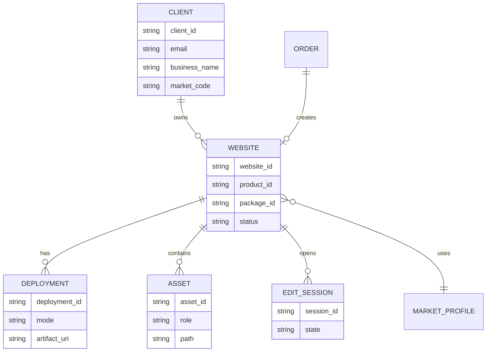
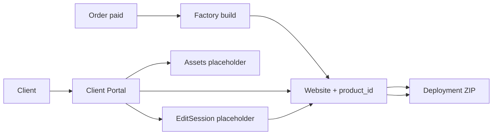

# Commercial Validation

**Rule:** Новые крупные функции добавляются только тогда, когда они решают проблему, подтверждённую реальными пользователями или аналитикой.

**Status:** ACTIVE (2026-07-21)  
**Mode:** market proof — not feature building  
**Prior mission:** Mission 2 — **COMPLETE**

## Roadmap

| Stage | Theme | Status |
|-------|--------|--------|
| Mission 0 | Foundation | ✅ |
| Mission 1 | Public Launch | ✅ |
| Mission 2 | Factory + Order Experience | ✅ |
| **Commercial Validation** | Market proof | **ACTIVE** (parallel) |
| **Mission 3** | Perception → semantics → market → portal · identity | **CLOSED** (CEO 2026-07-22) |
| **Mission 4** | Portal Infrastructure (R4.1–R4.6) · Platform v1 | **CLOSED** (CEO 2026-07-22) |
| **Mission 5** | Module Standard (Write · Read · Resource · Integration) | **CLOSED** (CEO 2026-07-22) |
| **Mission 6** | Product Platform Core (6.1–6.3) | **CLOSED** (CEO 2026-07-22) · core complete |
| **Platform Core v2** | Identity + Portal + Product (architecture stamp) | **ACCEPTED** (CEO 2026-07-22) |
| **Brand Architecture v1.0** | Virtus Core (platform) · Vector (AI Business Employee) | **ACCEPTED** (CEO 2026-07-22) · `docs/VIRTUS_BRAND_ARCHITECTURE_v1.md` |
| **Commercial Platform** | Purchases · Billing · Licenses · Redeem → Activation → Ownership | **CORE CLOSED** ✅ (CEO 2026-07-22) · Marketplace deferred |
| **Business Products** | ChatBot (Vector) · CRM · Analytics · Automation | **Vector Product Foundation CLOSED** ✅ |
| **AI Platform 1.0** | Protocol · Registry · Manager · Adapters · AIResponse | **CLOSED** ✅ (CEO 2026-07-22) |
| **AI Platform 2.0** | Prompt & Policy → Streaming → Tools → Actions → RAG | **AP2.1 PASS** ✅ · **AI Interaction Pipeline CLOSED** ✅ · AP2.2 not opened |
| **Product Track** | Generation 1 complete | **Virtus Core Gen1 CLOSED** ✅ |
| **Operational Readiness** | Pre-channel gate (not a Product Track) | **OR Gen1 CLOSED** ✅ (CEO 2026-07-22) |
| **Integration Track** | First real channel | **IT1.1 OPEN** · Website Widget |
| **Generation 2** | Commercial product | **G2.2** ✅ · **S1 Security** ✅ · **G2.3 Commercial FINAL PASS** ✅ · **Production Ready** ✅ |
| **Generation 3** | Evolution Center | **G3.1 FINAL PASS** (2026-07-23) |


## Mission 3 — REORDERED (2026-07-21, CEO)

**Why opened early:** Visual Product Audit + 3-second Premium Test = **FAIL** (then improved).  
**Why reordered again:** Niche sweep (8 niches) proved Media Intelligence is size/aspect only —  
Beauty / Computer / Green heroes off-topic. Systemic algorithm gap, not dental-only.

| Slice | Theme | Status |
|-------|--------|--------|
| **R3.1** | **Premium Visual System** | **✅ PASS** (CEO 2026-07-22) |
| **R3.2** | **Section-Aware Media Gate** | **✅ PASS** (CEO 2026-07-22) |
| **R3.2.1** | **UX Polish** (back-to-top · overflow) | **✅ PASS** (CEO 2026-07-22) |
| ✅ **R3.3** | **Section-Aware Content Gate** | **PASS** (CEO 2026-07-22) |
| ✅ **R3.4** | **Global Market** | **CLOSED** (CEO 2026-07-22) |
| → R3.4.1 | Market Profile (SSOT) | PASS · `fb99cbe` |
| → R3.4.1.R | Regression Cleanup | PASS · `e3aa8d7` |
| → R3.4.2.1 | Market Registry | PASS · `abb300d` |
| → R3.4.2.2 | Factory Consumers | PASS · `a675c60` |
| → R3.4.2.3 | Market Expansion Validation | PASS · `9756c84` |
| **R3.5** | **Client Portal** | **OPEN** |
| → ✅ **R3.5.1** | **Client Portal Architecture** | **PASS** · `4a5a3f8` |
| → ✅ **R3.5.2** | **Website Domain Model** | **PASS** · `fad5382` |
| → ✅ **R3.5.3** | **Client Domain Model** | **PASS** · `871c993` |
| → ✅ **R3.5.4** | **Deployment Domain Model** | **PASS** · `861be5a` |
| → ✅ **R3.5.5** | **Assets Domain Model** | **PASS** · `72b6c72` |
| → ✅ **R3.5.6** | **EditSession Domain Model** | **PASS** · `361f77e` |
| ✅ **R3.5** | **Domain Foundation** | **CLOSED** (CEO 2026-07-22) |
| **R3.6** | **Portal Services** | **OPEN** |
| → ✅ **R3.6.1** | **Portal Read Service** | **PASS** · `bbfd75f` |
| → ✅ **R3.6.2** | **Portal Query Objects** | **PASS** · `fe30d15` |
| → ✅ **R3.6.3** | **Portal View Models** | **PASS** · `f118637` |
| → ✅ **R3.6.4** | **EditSessionView** | **PASS** · `626c6dc` |
| ✅ **R3.6** | **Read Layer** | **CLOSED** (CEO 2026-07-22) |
| **R3.7** | **Portal API** | **OPEN** |
| → ✅ **R3.7.1** | **Read API Contract** | **PASS** · `8477df9` |
| → ✅ **R3.7.2** | **Read API Handlers** | **PASS** · `2cbd0e1` |
| → ✅ **R3.7.3** | **FastAPI Read Router** | **PASS** · `61dee70` |
| → ✅ **R3.7.4** | **Portal Composition Root** | **PASS** · `86068ee` |
| ✅ **R3.7** | **Read API Foundation** | **CLOSED** (CEO 2026-07-22) |
| **R3.8** | **Portal Integration** | **OPEN** |
| → ✅ **R3.8.1** | **Portal Integration Profile** | **PASS** · `e88e3e9` |
| → ✅ **R3.8.2** | **Controlled Portal Registration** | **PASS** · `b1717ad` |
| → ✅ **R3.8.3** | **Portal Health Verification** | **PASS** · `61a0948` |
| → ✅ **R3.8.4** | **Portal Lifecycle Contract** | **PASS** · `ba48f18` |
| ✅ **R3.8** | **Portal Infrastructure** | **CLOSED** (CEO 2026-07-22) |
| **R3.9** | **Portal Business Features** | **OPEN** |
| → ✅ **R3.9.1** | **Website Read Context** | **PASS** · `22f5a0b` |
| → ✅ **R3.9.2** | **Website View Contract** | **PASS** · `27a963d` |
| → ✅ **R3.9.3** | **Website Read Query** | **PASS** · `0185749` |
| → ✅ **R3.9.4** | **Website Read Facade** | **PASS** · `b2c51f8` |
| ✅ **R3.9** | **Website Read Pipeline** | **CLOSED** (CEO 2026-07-22) |
| **R3.10** | **Portal Cabinet Views** | **OPEN** |
| → ✅ **R3.10.1** | **Website Dashboard View** | **PASS** · `10a175b` |
| → ✅ **R3.10.2** | **Website Dashboard Query** | **PASS** · `412638b` |
| → ✅ **R3.10.3** | **Website Dashboard Facade** | **PASS** · `9bff27e` |
| ✅ **R3.10** | **Portal Dashboard Stack** | **CLOSED** (CEO 2026-07-22) |
| ✅ **R3.11** | **Portal Dashboard API** | **CLOSED** (CEO 2026-07-22) |
| → ✅ **R3.11.1** | **Dashboard Read Endpoint** | **PASS** · `51bbfb9` |
| → ✅ **R3.11.2** | **Dashboard Endpoint Integration** | **PASS** · `121d8f9` |
| **R3.12** | **Account & Activation** | **CLOSED** (CEO 2026-07-22) |
| → ✅ **R3.12.1** | **Account Ownership Architecture** | **PASS** · `83c8c56` · **CLOSED** |
| → ✅ **R3.12.2** | **Activation Token Domain** | **PASS** · `80b641e` |
| → ✅ **R3.12.3** | **Password Creation** | **PASS** · `458be7d` |
| → ✅ **R3.12.4** | **Authentication Domain** | **PASS** · `b7a9763` |
| → ✅ **R3.12.5** | **Authorization Domain** | **PASS** · `4db26bd` |

### R4 — Portal HTTP Integration (CEO 2026-07-22)

**Policy:** Session + HTTP-only cookie for Virtus Core web Portal. **No JWT** until separate clients (mobile/API) need it.  
**Phase A:** transport only · **Phase B:** session / middleware / protected routes.  
**Review lenses:** Architecture · Security · Product.

| Slice | Theme | Status |
|-------|--------|--------|
| → ✅ **R4.1** | **HTTP Login Endpoint** | **PASS** · `c60bca0` |
| → ✅ **R4.2** | **Session Domain / Store** | **PASS** · `78eb847` |
| → ✅ **R4.3** | **Authentication Middleware** | **PASS** · `b5e5790` |
| → ✅ **R4.4** | **Protected Dashboard** | **PASS** · `aef6ce0` |
| → ✅ **R4.5** | **Logout** | **PASS** · `ee2650f` |
| → ✅ **R4.6** | **End-to-End User Flow** | **PASS** · `a623f13`|

| **R4** | Portal HTTP Integration (session-first, no JWT) | **CLOSED** (CEO 2026-07-22) · Portal Platform v1 |

**R4.1 out of scope:** Session · Cookie · JWT · Middleware · Protected routes.

**Not now (until R5.1+):** full CRM · Billing · Marketplace · Domain UI.  
**Backlog until later slices:** Gallery Upload · Content Editing · Domain · Analytics UI.

**Backlog (tech debt — not bugs, not R3.2 blockers):**
- Restaurant Showcase Pack (dedicated stills; generic food-retail OK for now)
- Gallery Pack Expansion (Business/Premium section media)
- Contact Visual Pack (facade / entrance / reception)
- Premium Background Styles (Classic White / Soft Gradient / AI bg / upload at order)
- UX Polish → **R3.2.1 ✅ PASS**

### Owner Visibility Rule (binding)

> If the product owner opens the screen and does not see the claimed improvement **without hints**, the improvement is **not done** — regardless of lines of code or internal checkboxes.

### Premium Test (R3.1 acceptance)

Show **Basic / Business / Premium** with **no names and no prices**. Ask: *Which is the most expensive?*  
PASS = ≥ **8 / 10** pick Premium immediately.

**2026-07-21 before:** FAIL. **After Premium Visual:** agent + CEO ≈ 8–8.5/10.  
**2026-07-22 CEO:** **R3.1 = PASS ✅**  
Evidence: `_audit_visual_dental_r31/sandbox/compare-3sec.html` (:8767).

### Section-Aware Media Gate (R3.2 — definition)

**Goal:** not «generate better» — **do not publish illogical sites**.

Small smart step — **not** a new generator / not a new neural net / **no LLM**.

```
niche + section → allowed categories → media tag → PASS / FAIL
```

On FAIL: swap image · or mark FAIL · never publish an obviously illogical result.

**Publish path:** Quality Gate → **Media Gate** → Publish.

| Block | Expectation (example) | Fail → |
|-------|----------------------|--------|
| Hero | Face / customer result / front-of-house matching niche | swap / reject |
| Gallery | Interior / team / real work — not random tech dump | swap |
| Services | Relates to services of **this** niche | swap |
| About | Team / owner / office | swap |
| Contact | Facade / map / entrance / reception | swap |

Niche deny examples (Hero): Beauty ≠ restaurant/florist/industry · Computer ≠ flowers/café/dental · Green ≠ cosmetics/restaurant.

Today (before): `niche → hash hero slot → pixel gate → insert`.  
Target: `niche → page → **which block?** → what user expects → pick → **meaning check** → insert`.

**Acceptance (R3.2):** multi-niche sweep — Auto · Beauty · Law · Restaurant · Green · Computer · Dental · Handwerk.  
Off-topic hero in any niche = **FAIL**. Same Owner Visibility Rule.

Evidence baseline: `_audit_niche_sweep/` + canvas `niche-semantic-sweep`.  
Module: `dashboard/backend/app/factory/media_gate.py`.

**Live sweep 2026-07-21 (agent):** `_audit_media_gate_r32/` · `http://127.0.0.1:8769/`  
8/8 niches correct ID · media_gate_ok · Beauty/Computer/Green no longer wrong-niche heroes.  
**Non-blockers (CEO):** Gallery/Contact N/A on Business = package expansion, not Media Gate. Restaurant generic food-retail OK until Showcase Pack.  
**2026-07-22 CEO:** **R3.2 = PASS ✅**

### Section-Aware Content Gate (R3.3 — PASS ✅)

Same principle as Media Gate, applied to **copy** — no LLM mega-engine.

**Question Media Gate answers:** «Подходит ли изображение этому разделу?»  
**Question Content Gate answers:** «Подходит ли этот текст этому разделу и этой нише?»

**Principles (binding):** no LLM · rule-based · predictable · check before publish · PASS/FAIL (not «guess») · repair = niche defaults swap, not rewrite.

**Publish path:**
```
Compose → Quality Gate → Media Gate → Content Gate → Compliance → Publish
```

**Goal:** do not publish illogical / generic text for a niche.

| Check | Expectation | Fail → |
|-------|-------------|--------|
| Hero | Headline / subtitle / CTA speak the niche (not «Beratung · Umsetzung · Lösungen») | FAIL / niche defaults |
| Services | Real niche services — not «Beratung / Umsetzung / Support» when niche has craft vocabulary | swap niche defaults / FAIL |
| Benefits | Niche-appropriate claims (no cross-industry tokens) | swap niche defaults / FAIL |
| Navigation | Header = section links + one CTA only — no Geprüft / Lokal / Zuverlässig / Premium-Marken | FAIL |
| Legal (stub) | Hook only: market → legal profile → footer (R3.4) | not blocking in R3.3 |

```
niche + section → expected copy shape → text rules → PASS / FAIL
```

**Module:** `app/factory/content_gate.py` · wired in `composer_engine` + `compliance_engine` · meta `content_gate`.  
**Live sweep 2026-07-22 (agent):** `_audit_content_gate_r33/` · `_run_content_gate_sweep_r33.py`  
**RESULT: 8/8 PASS** — Hero / Services / Benefits / Navigation for Auto · Beauty · Law · Restaurant · Green · Computer · Dental · Handwerk.  
**2026-07-22 CEO:** **R3.3 = PASS ✅**  
Legal Gate = stub only (R3.4). Security Review = separate pre-scale checklist (not R3.3).

### R3.2.1 — UX Polish (small, not a mission)

**2026-07-22 CEO:** **R3.2.1 = PASS ✅**

- Remove needless nested page-scroll shells (`overflow-x: clip`, prefer window scroll)
- Back-to-top: **Basic** none · **Business** simple round · **Premium** dark + hover lift
- Appear after ~480px · smooth scroll · `prefers-reduced-motion` · mobile safe-area
- Module: `app/factory/ux_polish.py` + `assets/ux_polish.js`

Does not change architecture.

### Frozen until later slices

Global Market · Client Portal · full Semantic Content Engine.  
Premium Background Styles + Restaurant/Gallery/Contact packs = backlog above.

## Mission 2 — CLOSED

| Capability | Status |
|------------|--------|
| Factory v1 | ✅ |
| Order Experience v2 | ✅ |
| Analytics (A2.1 funnel) | ✅ |
| Commercial Ready | ✅ |

Architecture point set. No large new directions until real buyers validate the path  
(visit → order → pay → Factory/Compliance delivery → result).

**Frozen unless critical bug:** client cabinet, CRM, calendar, blog, AI-chat expansions, heavy integrations.

## Guiding question

> Does the market confirm that what we built actually delivers value?

Not: «What else should we build?»

## Focus (only these four)

1. **First real users** — get people to start an order; watch behavior  
2. **First real payments** — full live chain (Stripe → Factory → Compliance → delivery → notify)  
3. **Funnel check** — Money Monitor → Order Experience Funnel; where drop-off concentrates  
4. **Feedback patterns** — repeating questions/friction only (ignore one-offs until they repeat)

## Decision journal (facts only)

Add one row (or one dated section) after each real observation window.  
Improvements listed here must cite funnel numbers or repeating friction — not gut feel.

### Template

| Field | Value |
|-------|--------|
| Date | YYYY-MM-DD |
| Visitors (approx.) | |
| Order started | |
| Reached step 2 / 3 / 4 | |
| Checkout summary viewed | |
| Stripe redirect | |
| Paid | |
| Drop-off hotspot | |
| Problems (live chain) | |
| Repeating feedback | |
| Decision (if any) | Based on: … |
| Next check | |

---

### Entries

_(none yet — first real traffic / payment opens Entry 1)_

<!--
### YYYY-MM-DD — Entry N

- Visitors:
- Order started:
- Paid:
- Drop-off:
- Problems:
- Feedback pattern:
- Decision:
-->

## Where to look

- Funnel card: Money Monitor / Business KPI → **Order Experience Funnel**  
- Events: `memory/pricing_analytics.jsonl` (via existing Path A analytics)  
- Order UX notes (shipped slices): `docs/ORDER_EXPERIENCE_CHANGELOG.md`

## After validation

Commercial Validation stays **ACTIVE** in parallel (real orders / funnel).  
Mission 3: **CLOSED ✅** (CEO 2026-07-22) · R3.1–R3.12 complete · domain foundation for Portal / Identity.  
**R4.1–R4.6 PASS ✅** · **Mission 4 / Portal Platform v1 CLOSED** (CEO 2026-07-22).  
**Portal Platform v1 — Accepted for Expansion** (CEO 2026-07-22).  
**R5.1 PASS ✅** · **Module Architecture** established (CEO 2026-07-22) · `7db23a0`.  
**R5.2 PASS ✅** · Analytics Overview (Read-only) · `ba39b43` · Write+Read blueprints confirmed.  
**R5.3 PASS ✅** · `f1c15fc` · Module Standard formed (Write+Read+Resource State).  
**R5.4 PASS ✅** · `92ce896` · Integration Module confirmed.  
**Mission 5 — CLOSED ✅** (CEO 2026-07-22) · Module Standard proven (4 module classes).  
**Mission 6 — Product Platform Architecture Stamp ✅** (CEO 2026-07-22) · no mass refactor.  
**Mission 6.1 PASS ✅** · 6f9e52f · Product Catalog platform endpoint.  
**Mission 6.2 PASS ✅** · e7f86c6 · foundation Product Catalog + Product Ownership.  
**Mission 6.3 PASS ✅** · 546b5bc · Product Platform core (Catalog+Ownership+Activation) complete.  
**Mission 6 — CLOSED ✅** (CEO 2026-07-22) · Product Platform Core complete.  
**Platform Core v2 — ACCEPTED ✅** (CEO 2026-07-22) · Identity + Portal + Product · foundation complete.  
**Terminology shift:** further work = **Commercial Platform** + **Business Products** (not new “architecture missions”).  
**Commercial Platform 6.4 PASS** · `0033110` · Purchase Invariant + Commercial Boundary.  
**Commercial Platform 6.5 PASS** · `e75d778` · License central (entitlement · redeem → Activation).  
**Commercial Platform 6.6 PASS** · `0104b44` · Billing financial ledger.  
**Commercial Platform Core — CLOSED ✅** (CEO 2026-07-22) · Purchases · Billing · Licenses · Redeem → Activation → Ownership.  
**Not opened:** Marketplace · AP2.2 Streaming · KimiAdapter · per-profile Preferred AI Provider · real channel SDKs.  
**Business Product BP1.1 — PASS ✅** · ChatBot Business Profile & Industry Template (no AI · no channel SDKs).  
**Business Product BP1.2 — PASS ✅** · Business Knowledge (facts only · fixed categories).  
**Business Product BP1.3 — PASS ✅** · `422d1a7` · Channel Connections stub (registry · config · status).  
**Business Product BP1.4 — PASS ✅** · `d003ef2` · Conversation Engine stub (context builder · no AI).  
**Vector Product Foundation — CLOSED ✅** (CEO 2026-07-22) · Profile · Template · Knowledge · Channels · Conversation Engine.  
**AI Platform AP1.1 — PASS ✅** · `8e758ac` · Provider Layer (Protocol · Registry · Manager · stubs).  
**AI Platform AP1.2 — PASS ✅** · `479184e` · Provider Adapters (OpenAI/Anthropic/Ollama · unified AIResponse).  
**AI Platform 1.0 — CLOSED ✅** (CEO 2026-07-22) · Protocol → Registry → Manager → Adapters → AIResponse.  
**AI Platform AP2.1 — PASS ✅** (CEO 2026-07-22) · Prompt & Policy Layer (PromptPackage · vendor-neutral behavior).  
**AI Interaction Pipeline — CLOSED ✅** (CEO 2026-07-22) · ConversationContext → Prompt & Policy → PromptPackage → Provider Layer → AIResponse.  
**Product Track PT1.1 — PASS ✅** (CEO 2026-07-22) · Vector First Run Experience (orchestrator only · no new domain models).  
**Product Track PT1.2 — PASS ✅** (CEO 2026-07-22) · Knowledge Management UI · Knowledge Workspace opened for owners.  
**Product Track PT1.3 — PASS ✅** (CEO 2026-07-22) · Channel Setup UX · Vector Workspace path prepared (First Run → Knowledge → Channels).  
**Product Track PT1.4 — PASS ✅** (CEO 2026-07-22) · Vector Dashboard (aggregate only · no business logic).  
**Product Track Iteration 1 — CLOSED ✅** (CEO 2026-07-22) · First Run · Knowledge Workspace · Channel Setup · Vector Dashboard.  
**Product Track PT2 — CLOSED ✅** (CEO 2026-07-22) · Customer Operations Workspace complete.  
**Operations Workspace Generation 1 — CLOSED ✅** (CEO 2026-07-22) · Dashboard · Activity · Queue · Inbox · Conversation · Customers.  
**Product Track PT3 — CLOSED ✅** (CEO 2026-07-22) · AI Assisted Operations complete.  
**AI Assisted Workspace Generation 1 — CLOSED ✅** (CEO 2026-07-22) · Draft · Summary · Review · Priority · Tags · Knowledge hints · Insights.  
**Product Track PT4 — CLOSED ✅** (CEO 2026-07-22) · Business Actions complete.  
**Human-in-the-Loop Execution Model — CLOSED ✅** (CEO 2026-07-22) · AI Review → Human Approval → Business Actions → Audit Trail.  
**Virtus Core Generation 1 — CLOSED ✅** (CEO 2026-07-22) · Foundation → Vector → AI → Product → Operations → Assistance → Business Actions.  
**Operational Readiness Generation 1 — CLOSED ✅** (CEO 2026-07-22) · Correlation · Structured Logging · Metrics · Provider Resilience · Action Audit.  
**Integration Track IT1 — OPEN** (CEO 2026-07-22) · IT1.1 Website Widget (first external channel · real users as requirements source).  
**Not opened:** AP2.2 Streaming · AP2.3 Tool Calling · AP2.5 RAG · Marketplace · CRM Automation.  
**Vector AI Foundation — CLOSED ✅** (CEO 2026-07-22) · Conversation Engine → ConversationContext → AI Provider Layer.  
**Frozen after stamp:** AuthN/AuthZ · Module Blueprint · Product Catalog/Ownership/Activation APIs · Bridge Strategy · Commercial Platform Core · ChatBot Knowledge/Channel/Conversation Invariants · Brand Architecture v1.0 · Vector Product Foundation · AI Provider/Adapter Invariants · AI Platform 1.0 · Prompt & Policy Invariant · AI Interaction Pipeline · Business Action approval invariant · Human-in-the-Loop Execution Model · Virtus Core Generation 1 · Operational Readiness Gen1 (log schema · request_id · operator-safe provider errors).  
**R4 policy (frozen):** server session + HTTP-only cookie; JWT deferred.  
**R3.12 report rule (historical):** Security Impact + Upgrade Path + Future Roles.

### R3.4 — CLOSED (CEO 2026-07-22)

**Capability:** Global Market (= choose any registered market).  
**Entities:** MarketRegistry → `resolve(market_code)` → MarketProfile (SSOT for chrome).  
**Proven:** FR/NL/AT/ES added without changing Composer / Landing Builder / Footer.  
**Separate layers (keep independent for now):** Market Profile · Market Design · Market Delivery.

Commits: `fb99cbe` · `e3aa8d7` · `abb300d` · `a675c60` · `9756c84`.

### R3.5.1 — Client Portal Architecture — PASS ✅ (CEO 2026-07-22)

**Goal:** minimal ownership model so Portal does not become a mix of CRM + CMS + file manager.  
**Commit:** `docs: Client Portal architecture R3.5.1 (Mission 3)`.

#### Answers (binding for later slices)

1. **Who owns the site?** A **Client** (business owner identity). Today Path A only has order contact fields — Portal introduces Client as first-class owner.
2. **How is the site linked?** Client **1 — N** Website (Project). Website points at Factory `product_id` / sandbox artifact. An **Order** may *create* the first Website; it is not the long-term owner.
3. **Entities (minimum):**

| Entity | Responsibility | Maps from today |
|--------|----------------|-----------------|
| **Client** | Owner identity (email, business_name, market) | order contacts / visitor_id |
| **Website** | One published/manageable site project | `product_id` + `meta.json` + sandbox |
| **Deployment** | How/where the site is delivered (ZIP now; host/URL later) | `deployment_preference` + ZIP |
| **Assets** | Media library for that Website (placeholder API) | `client_assets` + `assets/` |
| **EditSession** | Bounded change batch before publish (placeholder) | Factory `revision` / improve |

#### Entity diagram



#### Data flow



#### Responsibility boundaries

| Layer | Owns | Must not own |
|-------|------|--------------|
| **Factory** | Generate / rebuild / gates / MarketProfile chrome | Client login, gallery CMS, billing CRM |
| **Client Portal** | Auth'd management of *their* Website | Generating new niches, CEO Mission Control |
| **Deployment** | Artifact + publish record | Editing content |
| **Assets / EditSession** | Placeholders until R3.5.x | Full CMS / AI rewrite engine |

#### Future features → entities

| Feature | Primary entities |
|---------|------------------|
| Gallery upload | Website → Assets → (EditSession) → Deployment |
| Content editing | Website → EditSession → meta/HTML fields |
| Domain | Website → Deployment (host/DNS record) |
| Analytics | **Website → Analytics** (site state; not Deployment history) |

**R3.5.1 PASS criteria:** diagrams + boundaries above · **no Portal UI/auth/pages code in this slice.** ✅

**Architecture notes (backlog — not R3.5):**
- **Workspace** (future): Client → Workspace → Website — for multi-site / roles / staff. Do **not** introduce in R3.5; note only.
- **Analytics** attach to Website (live site state). Deployment = publish history (ZIP, domain record, version, published_at, rollback).

**Not in R3.5.1:** implementation · auth · Gallery · CRM · Domain UI.

### R3.5.2 — Website Domain Model — PASS ✅ (CEO 2026-07-22)

**Module:** `dashboard/backend/app/portal/website.py` · commit `fad5382`.  
**Tests:** `tests/test_website_domain_r352.py` (5 passed).

```
Client (client_id)
      │
      ▼
Website (website_id, product_id, market_code, status, …)
      │
      ▼
Deployment (deployment_id, website_id)   ← publish record
Order ──website_id──▶ Website            ← creates, does not own
```

**Backlog notes (not this slice):** status as formal Enum · Website → Deployments[] with current marker.

**Not in R3.5.2:** Portal UI · auth · API routes · persistence · Gallery.

### R3.5.3 — Client Domain Model — PASS ✅ (CEO 2026-07-22)

**Module:** `dashboard/backend/app/portal/client.py` · commit `871c993`.  
**Fields:** client_id · display_name · primary_email · preferred_language · created_at · updated_at.  
**Link:** `website_for_client(client, …)` → `Website.client_id == Client.client_id`.  
**Not in R3.5.3:** Auth · roles · teams · permissions · Portal UI/API.

**Backlog notes:** `primary_email` = contact, not login id · `preferred_language` = Portal UI preference (Website language stays MarketProfile).

### R3.5.4 — Deployment Domain Model — PASS ✅ (CEO 2026-07-22)

**Module:** `dashboard/backend/app/portal/deployment.py` · commit `861be5a`.  
**Fields:** deployment_id · website_id · artifact_id · version · status · created_at.  
**Link:** `Website.deployment_id` ↔ `Deployment.website_id` via `attach_deployment`.  
**Not in R3.5.4:** publish process · hosting · domains · ZIP storage · API/UI.

**Backlog notes:** `version` is per-Website sequence (not Factory-global) · keep `Website.deployment_id` as current pointer when Deployments[] arrives.

### R3.5.5 — Assets Domain Model — PASS ✅ (CEO 2026-07-22)

**Module:** `dashboard/backend/app/portal/asset.py` · commit `72b6c72`.  
**Fields:** asset_id · website_id · asset_type · artifact_ref · created_at.  
**Link:** `Asset.website_id` → Website (N assets per site).  
**Not in R3.5.5:** Gallery · upload · storage · CDN · resize · binary data · API/UI.

**Backlog notes:** keep `asset_type` as constrained set · `artifact_ref` is an **opaque reference** (Portal must not assume URL/path/UUID format).

### R3.5.6 — EditSession Domain Model — PASS ✅ (CEO 2026-07-22)

**Module:** `dashboard/backend/app/portal/edit_session.py` · commit `361f77e`.  
**Fields:** session_id · website_id · status · started_at · ended_at (optional).  
**Link:** `EditSession.website_id` → Website.  
**Not in R3.5.6:** editor · autosave · realtime · version history · API/UI.

**Backlog notes:** closed/cancelled sessions are immutable · at most one `open` EditSession per Website (revisit if collaboration arrives).

### R3.5 — Domain Foundation — CLOSED ✅

```
Client → Website → Deployment | Asset | EditSession
```

No Portal UI/API/Auth/persistence in R3.5. Next layer = services (R3.6), then API/UI.

### R3.6.1 — Portal Read Service — PASS ✅ (CEO 2026-07-22)

**Module:** `dashboard/backend/app/portal/read_service.py` · commit `bbfd75f`.  
**Types:** `PortalCatalog` (in-memory snapshot) · `PortalReadService`  
**Methods:** `get_client` · `get_website` · `get_current_deployment` · `get_assets` · `get_open_edit_session`  
**Not in R3.6.1:** mutations · persistence · API endpoints · Auth · UI · editing.

**Rules:** depends on catalog abstraction (`PortalCatalogView`) · missing → `None` / `()` · `get_current_deployment` uses `Website.deployment_id`.

### R3.6.2 — Portal Query Objects — PASS ✅ (CEO 2026-07-22)

**Module:** `dashboard/backend/app/portal/queries.py` · commit `fe30d15`.  
**Types:** `ClientQuery` · `WebsiteQuery` · `AssetQuery` (optional `asset_type` filter).  
**ReadService** accepts Query objects only — no HTTP / FastAPI coupling.  
**Not in R3.6.2:** API · Auth · persistence · mutations.

**Rule:** Query Objects hold **parameters only** — no computation, business validation, catalog access, or load methods. Extend filters on the Query (e.g. `AssetQuery`), not on `get_assets()` signatures.

### R3.6.3 — Portal View Models — PASS ✅ (CEO 2026-07-22)

**Module:** `dashboard/backend/app/portal/views.py` · commit `f118637`.  
**Types:** `ClientView` · `WebsiteView` · `DeploymentView` · `AssetView` (+ pure `to_*_view` mappers).  
**ReadService** returns View Models for those four; domain entities unchanged.  
**Not in R3.6.3:** FastAPI · HTTP · UI · Auth · persistence.

### R3.6.4 — EditSessionView — PASS ✅ (CEO 2026-07-22)

**Adds:** `EditSessionView` · `to_edit_session_view(...)` · commit `626c6dc`.  
**ReadService:** `get_open_edit_session` → `EditSessionView | None`.  
**PASS:** all public `get_*` methods return View Models only.  
**Not in R3.6.4:** HTTP · FastAPI · UI · Auth · persistence.

**Rule:** View Models are **read-only** projections — not used to write back into the domain.

### R3.6 — Read Layer — CLOSED ✅

```
Domain → CatalogView → PortalReadService ← Query → View Models
```

Independent of HTTP / FastAPI / UI. Next = R3.7 Portal API.

### R3.7.1 — Read API Contract — PASS ✅ (CEO 2026-07-22)

**Module:** `dashboard/backend/app/portal/read_api_contract.py` · commit `8477df9`.  
**Declares:** GET `/portal/clients/{id}` · `/websites/{id}` · `/deployment` · `/assets` · `/edit-session`  
**I/O:** path/query models + View Models as responses.  
**Flags:** `mounted=False` · `auth=False` — not registered in `main.py`.  
**Not in R3.7.1:** FastAPI routers · Auth · write APIs · ReadService wiring.

**Rules / backlog:** after first public release, URL changes are breaking · optional `/api/v1/portal/...` later.

### R3.7.2 — Read API Handlers — PASS ✅ (CEO 2026-07-22)

**Module:** `dashboard/backend/app/portal/read_api_handlers.py` · commit `2cbd0e1`.  
**Type:** `PortalReadHandlers` — Contract path/query → `PortalReadService` → View Models.  
**Not in R3.7.2:** FastAPI mounting · Auth · middleware · persistence · write ops · HTTP Response.

**Rule:** Handlers do **not** interpret missing data (`None` / `()`). HTTP status mapping (e.g. 404) belongs only at the framework/router layer.

### R3.7.3 — FastAPI Read Router — PASS ✅ (CEO 2026-07-22)

**Module:** `dashboard/backend/app/portal/portal_read_router.py` · commit `61dee70`.  
**Router:** `portal_read_router` — GET only · calls handlers only · `None` → 404 at HTTP layer.  
**Not mounted** in `main.py`. No Auth · middleware · write API.  
**Domain / ReadService / Views / Queries:** unchanged.

**Rules / backlog:** only Router maps domain results → HTTP · replace `set_portal_read_handlers` global with FastAPI DI when mounting.

### R3.7.4 — Portal Composition Root — PASS ✅ (CEO 2026-07-22)

**Module:** `dashboard/backend/app/portal/portal_bootstrap.py` · commit `86068ee`.  
**API:** `compose_portal_read(catalog?)` → `PortalReadStack` (catalog · service · handlers · router).  
**Wiring only** — no Auth · no Persistence · not in `main.py` · router still unmounted.  
**Domain / ReadService / Handlers / Router source:** unchanged.

**Rule:** only `portal_bootstrap.py` may assemble the full Portal Read stack.

### R3.7 — Read API Foundation — CLOSED ✅

Contract · Handlers · unmounted Router · Composition Root. Ready for controlled app integration (R3.8).

### R3.8.1 — Portal Integration Profile — PASS ✅ (CEO 2026-07-22)

**Module:** `dashboard/backend/app/portal/portal_profile.py` · commit `e88e3e9`.  
**Profile:** `PORTAL_PROFILE` · `feature_enabled=False` · `router_provider` · `bootstrap_provider`.  
**Portal inactive** in the app — no mount · no Auth · profile not applied as live routes.

**Backlog:** read `feature_enabled` from settings/.env later (not hardcoded) — after controlled registration exists.

### R3.8.2 — Controlled Portal Registration — PASS ✅ (CEO 2026-07-22)

**Module:** `dashboard/backend/app/portal/portal_registration.py` · commit `b1717ad`.  
**API:** `register_portal_read(app)` — mounts **iff** `feature_enabled` is True; otherwise no-op.  
**main.py:** single call to `register_portal_read(app)` (safe while flag is False).  
**Not in R3.8.2:** enabling Portal · Auth · Persistence · business logic.

**Backlog:** if richer diagnostics are needed, return a result object instead of expanding the bool.

### R3.8.3 — Portal Health Verification — PASS ✅ (CEO 2026-07-22)

**Module:** `dashboard/backend/app/portal/portal_health.py` · commit `61a0948`.  
**API:** `portal_registration_snapshot()` → `feature_enabled` · `registration_attempted` · `registration_active`.  
**Read-only** — does not re-register · does not enable Portal · no new endpoints · `main.py` unchanged.

**Semantics:** `registration_attempted` = register ran (any result); success = `registration_active` only.

### R3.8.4 — Portal Lifecycle Contract — PASS ✅ (CEO 2026-07-22)

**Module:** `dashboard/backend/app/portal/portal_lifecycle.py` · commit `ba48f18`.  
**States:** `disabled` → `registered` → `active` → `teardown`  
**API:** `resolve_portal_lifecycle_state()` · `portal_lifecycle_snapshot()` · transitions table.  
Uses Profile · RegistrationOutcome · health. No endpoints · Auth · UI · behaviour change.

**Rule:** resist extra states (loading/failed/…) — keep the four-state machine.

### R3.8 — Portal Infrastructure — CLOSED ✅

Profile · Registration · Health · Lifecycle. Portal still inactive (`feature_enabled=False`). Next = business read features (R3.9).

### R3.9.1 — Website Read Context — PASS ✅ (CEO 2026-07-22)

**Module:** `dashboard/backend/app/portal/website_read_context.py` · commit `22f5a0b`.  
**Type:** `WebsiteReadContext` · `get_website(website_id)` → `WebsiteView | None`.  
**Read-only** — no endpoints · Auth · permissions · mutations.

**Rule:** keep Context focused on Website reads only — split specialized read modules later rather than bloating one class.

### R3.9.2 — Website View Contract — PASS ✅ (CEO 2026-07-22)

**Module:** `dashboard/backend/app/portal/website_view.py` · commit `27a963d`.  
**Type:** frozen `WebsiteView` (website_id · client_id · product_id · market_code · status · deployment_id).  
**Context** returns `WebsiteView` only — never the Website domain model.  
**Rule:** Portal never consumes internal domain objects directly · grow View fields only when Portal needs them.

### R3.9.3 — Website Read Query — PASS ✅ (CEO 2026-07-22)

**Module:** `dashboard/backend/app/portal/website_read_query.py` · commit `0185749`.  
**Type:** `WebsiteReadQuery` · `execute(website_id)` → `WebsiteView | None`.  
Uses `WebsiteReadContext` only — no Domain Website · no FastAPI · no business logic.

**Rule:** one Query = one use case (not a grab-bag query service).

### R3.9.4 — Website Read Facade — PASS ✅ (CEO 2026-07-22)

**Module:** `dashboard/backend/app/portal/website_read_facade.py` · commit `b2c51f8`.  
**Type:** `WebsiteReadFacade` · `get_website(website_id)` → `WebsiteView | None`.  
Uses only `WebsiteReadQuery` — future Portal UI entry for Website reads.  
No FastAPI · Auth · Domain · mutations.

**Rule:** do not stack more internal mediators above Facade — next layer is HTTP/API or UI.

### R3.9 — Website Read Pipeline — CLOSED ✅

View · Context · Query · Facade. Portal can safely read Website without Domain coupling.

### R3.10.1 — Website Dashboard View — PASS ✅ (CEO 2026-07-22)

**Module:** `dashboard/backend/app/portal/website_dashboard_view.py` · commit `10a175b`.  
**Type:** frozen `WebsiteDashboardView` (website · status · current_deployment).  
**Builder:** `build_website_dashboard_view(website, current_deployment=?)`.  
Cabinet aggregate — does not bloat `WebsiteView`. No API · Auth · UI · writes.

**Rule:** add CRM/Chat/Analytics into Dashboard only when those products exist — not empty placeholders.

### R3.10.2 — Website Dashboard Query — PASS ✅ (CEO 2026-07-22)

**Module:** `dashboard/backend/app/portal/website_dashboard_query.py` · commit `412638b`.  
**Type:** `WebsiteDashboardQuery` · `execute(website_id)` → `WebsiteDashboardView | None`.  
Uses `WebsiteReadFacade` + current deployment via `PortalReadService` (views only).  
No Domain Website · FastAPI · Auth · writes.

**Rule:** stop adding deeper read mediators — next layers are API/UI use cases.

### R3.10.3 — Website Dashboard Facade — PASS ✅ (CEO 2026-07-22)

**Module:** `dashboard/backend/app/portal/website_dashboard_facade.py` · commit `9bff27e`.  
**Type:** `WebsiteDashboardFacade` · `get_dashboard(website_id)` → `WebsiteDashboardView | None`.  
Uses only `WebsiteDashboardQuery` — sole entry for future Dashboard API.  
No FastAPI · Auth · UI · writes.

**Rule:** Facade = entry for **this** use case only — not one giant PortalFacade. Stop deeper read infrastructure.

### R3.10 — Portal Dashboard Stack — CLOSED ✅

Facade · Query · View (+ WebsiteView / DeploymentView). Ready for first HTTP read.

### R3.11.1 — Dashboard Read Endpoint — PASS ✅ (CEO 2026-07-22)

**Modules:** `portal_dashboard_router.py` · `portal_dashboard_registration.py` · commit `51bbfb9`.  
**Endpoint:** `GET /portal/websites/{website_id}/dashboard` → `WebsiteDashboardView`  
**Uses:** only `WebsiteDashboardFacade` · Auth stub (always allows) · mounted via `register_portal_dashboard(app)` in `main.py`.  
**Not in R3.11.1:** write APIs · real Auth · UI.

**Backlog:** unify Dashboard mount under `PortalIntegrationProfile` (one activation strategy for all Portal surfaces).

### R3.11.2 — Dashboard Endpoint Integration — PASS ✅ (CEO 2026-07-22)

**Module:** `dashboard/backend/app/portal/website_catalog.py`  
**Loader:** `load_portal_catalog_from_factory_sandbox()` maps Factory `meta.json` → `PortalCatalog`.  
**Registration** defaults to that catalog (override still allowed). Dashboard returns real Website data.  
**Not in R3.11.2:** Auth activation flow · Portal password · UI · write.

**Architecture note:** sandbox loader = temporary **adapter** into `PortalCatalog`; future DB/cloud adapters should replace it without touching Facade/Query/HTTP.

### R3.11 — Portal Dashboard API — CLOSED ✅

First live HTTP read · Factory → Portal path · real data.  
**CEO APPROVED** Mission 3 through R3.11 (2026-07-22).

### R3.12 — Account & Activation — (see CLOSED below)

Target path: `Email → Account → Owned Websites → Dashboard`.  
Series **CLOSED** — full write-up under «R3.12 — Account & Activation — CLOSED».

### R3.12.1 — Account Ownership Architecture — PASS ✅ (CEO 2026-07-22)

**Modules:** `account.py` · `ownership.py` · `invitation.py` · `account_ownership_architecture.py`  
**Entities:** Account ≠ Client · WebsiteOwnership · WebsiteInvitation (intent only).  
**Rule:** Account never owns Client directly — only `Account → Ownership → Website → Client`.  
**Not in R3.12.1:** Auth · password · JWT · HTTP · SMTP · Activation Token.

**Next:** R3.12.2 Activation Token Domain (domain only — no email/HTTP).

### R3.12.2 — Activation Token Domain — PASS ✅ (CEO 2026-07-22)

**Module:** `dashboard/backend/app/portal/activation_token.py` · commit `80b641e`  
**Entity:** `ActivationToken` bound to `Account.account_id`  
**Lifecycle:** `created` → `active` → `used` | `expired` | `revoked`  
**Invariants:** one-shot consume · future `expires_at` · terminal states immutable  
**Rule:** ActivationToken is **not** authentication — primary activation only; after use, Auth (R3.12.4+) owns ongoing access.  
**Not in R3.12.2:** email · SMTP · HTTP · links · password · JWT · UI.

**Next:** R3.12.3 Password Creation (domain first — no HTTP/login/JWT).

### R3.12.3 — Password Creation Domain — PASS ✅ (CEO 2026-07-22)

**Module:** `dashboard/backend/app/portal/password_credential.py`  
**Entity:** `PasswordCredential` (opaque `password_hash` only)  
**Account lifecycle:** `pending_activation` → `activated` → `ready`  
**Orchestration:** `complete_account_activation` · `create_primary_password`  
**Rules:** Password Creation does **not** authenticate; sole path to `Account.ready` is successful primary password creation after activation.  
**Not in R3.12.3:** login · JWT · cookies · reset/change · HTTP · UI · SMTP.

**Next:** R3.12.4 Authentication Domain (domain first — no HTTP/JWT/cookies).

### R3.12.4 — Authentication Domain — PASS ✅ (CEO 2026-07-22)

**Module:** `dashboard/backend/app/portal/authentication.py`  
**Entities:** `AuthenticationAttempt` · `AuthenticationResult`  
**API:** `authenticate(account, credential, presented_password_hash=...)`  
**Outcomes:** `authenticated` | `failed` (with internal `failure_reason`)  
**Rules:** answers only “credentials correct?” — no session / JWT / cookie;  
`failure_reason` is domain-internal — HTTP must map to a generic user message.  
**Not in R3.12.4:** HTTP · FastAPI · MFA · OAuth · rate limit · password reset.

**Next:** R3.12.5 Authorization Domain — “may this Account open this Website?” (before HTTP/JWT).

### R3.12.5 — Authorization Domain — PASS ✅ (CEO 2026-07-22)

**Module:** `dashboard/backend/app/portal/authorization.py`  
**Entities:** `AuthorizationRequest` · `AuthorizationResult`  
**API:** `authorize` / `authorize_account_for_website` — gate via ``WebsiteOwnership`` only  
**Roles:** `allowed_roles` set (default `{"owner"}`) — extensible without redesign  
**Rules:** does not authenticate · does not create session · module-agnostic (Dashboard/CRM/… are callers only)  
**Not in R3.12.5:** HTTP · JWT · permissions engine · ACL editor.

### R3.12 — Account & Activation — CLOSED ✅ (CEO 2026-07-22)

```text
Ownership → Activation → Password Creation → Authentication → Authorization
```

Domain foundation complete. **Next (infra):** HTTP login · session/JWT · middleware · protected Portal endpoints — without changing R3.12 domain models.

### Mission 3 — CLOSED ✅ (CEO 2026-07-22)

Factory (product) · Portal (client work) · Identity (R3.12 lifecycle) — foundation for Virtus Core client platform.  
Further work is **infrastructure + UX**, not domain invention.

### R4 — Portal HTTP Integration — OPEN

**Phase A (R4.1):** HTTP → AuthenticationFacade → Domain → `{authenticated: true|false}` — no session/JWT.  
**Phase B (R4.2–R4.5):** Session store · cookie · middleware · protected Dashboard · logout.  
**R4.6:** full activation path (publish → email → activate → password → login → Dashboard).  
**JWT:** deferred until multi-client need.

### R4.1 — HTTP Login Endpoint — PASS ✅ (CEO 2026-07-22)

**Modules:** `authentication_facade.py` · `login_api_contract.py` · `portal_login_router.py` · `portal_login_registration.py`  
**Endpoint:** `POST /portal/login` → `{authenticated: true|false}`  
**Rules:** never exposes domain `failure_reason` · no Set-Cookie / JWT / session · 400 for bad body · 200 for processed auth.  
**Note:** AuthenticationFacade = sole app entry for future login channels (SSO etc.).  
**Not in R4.1:** Session · Cookie · Middleware · Protected Dashboard · password hashing algo · rate limit.

**Next:** R4.2 Session Infrastructure (create session + HTTP-only cookie after login).

### R4.2 — Session Infrastructure — PASS ✅ (CEO 2026-07-22)

**Modules:** `session.py` · `session_store.py` · `session_facade.py` · `session_cookie.py`  
**Login:** on success → `SessionFacade.start_session` → HttpOnly cookie `virtus_session`  
**Cookie:** HttpOnly · SameSite=Lax · Secure via `PORTAL_COOKIE_SECURE`  
**Store:** `SessionStore` Protocol + in-memory adapter (`invalidate` ready for R4.5)  
**Not in R4.2:** Middleware · cookie reading · Protected Dashboard · Logout endpoint · JWT · CSRF.

**Next:** R4.3 Authentication Middleware — read cookie → active Session → Account (no Authorization).

### R4.3 — Authentication Middleware — PASS ✅ (CEO 2026-07-22)

**Modules:** `request_principal.py` · `portal_authentication_middleware.py`  
**Behavior:** cookie → SessionFacade → Account | Anonymous on `request.state` · never 401/403  
**Invariant:** Middleware identifies; it does not authorize.  
**Note:** `RequestPrincipal` stays identity-only (no permissions / business payload).  
**Not in R4.3:** Authorization · Dashboard protection · redirect · logout · JWT.

**Next:** R4.4 Protected Dashboard — RequestPrincipal → Authorization → Dashboard.

### R4.4 — Protected Dashboard — PASS ✅ (CEO 2026-07-22)

**Modules:** `authorization_facade.py` · `ownership_directory.py` · updated `portal_dashboard_router.py`  
**Chain:** Principal → AuthorizationFacade → DashboardFacade  
**HTTP:** Anonymous → 401 · no Ownership → 403 · allowed → 200  
**Invariant:** who / may / what stay separate.  
**Template:** same AuthN → AuthZ → ModuleFacade pattern for future CRM / Analytics / ChatBot.  
**Not in R4.4:** Logout · JWT · CRM · other modules.

**Next:** R4.5 Logout — invalidate session + clear cookie.

### R4.5 — Logout — PASS ✅ (CEO 2026-07-22)

**Endpoint:** `POST /portal/logout` → 204  
**Chain:** cookie → SessionFacade.invalidate → clear HttpOnly cookie  
**Idempotent:** repeat logout always 204  
**Note:** keep `invalidate_session(id)`; multi-device = future separate APIs.  
**Not in R4.5:** Auth Domain changes · AuthZ · JWT · UI.

### R4 Phase B — COMPLETE ✅ (CEO 2026-07-22)

Login · Session · Middleware · Protected Dashboard · Logout.  
**Next:** R4.6 End-to-End User Flow (publish → activate → password → login → dashboard → logout).

### R4.6 — End-to-End User Flow — PASS ✅ (CEO 2026-07-22)

**Module:** `portal_user_journey.py` — orchestration only (no new domain rules).  
**Proof:** integration test mounts Login + Middleware + Dashboard + Logout.  
**Path:** activate → password → login → session → AuthZ → dashboard → logout → Anonymous.  
**Not in R4.6:** new Domain · JWT · OAuth · MFA · new Portal modules.

### Mission 4 / Portal Platform v1 — CLOSED ✅ (CEO 2026-07-22)

R4.1–R4.6 complete. Identity (Mission 3) + Infrastructure (Mission 4) = Minimum Complete User Journey.  
Further work = **modules on the platform** using AuthN → AuthZ → ModuleFacade.

### Portal Platform v1 — Accepted for Expansion ✅ (CEO 2026-07-22)

| Stage | Status |
|-------|--------|
| Mission 3: Identity Foundation | **CLOSED** |
| Mission 4: Portal Platform v1 | **CLOSED** |
| Platform status | **Accepted for Expansion** |

#### Platform Invariant (binding)

Every Portal module **MUST** use platform services:

- Authentication  
- Authorization  
- Session  
- Ownership  

Portal modules **MUST NOT** implement their own authentication, authorization, session, or ownership logic.

#### Standard module flow

```text
Authentication
    ↓
Authorization
    ↓
ModuleFacade
    ↓
Module
```

#### Mission 5 order (product)

1. **Website Settings** (R5.1) — write module ✅  
2. **Analytics** (R5.2) — read-only module · **PASS ✅** · `ba39b43`  
3. **Website Domain Management** (R5.3) — resource-state module · **PASS ✅** · `f1c15fc`  
4. **ChatBot Integration** (R5.4) — integration module · **PASS ✅** · `92ce896`  
5. **CRM** (R5.5) — complex business module  

**Why not CRM first:** large domain; must not dictate platform architecture.  
**Why Analytics before Domain:** prove Blueprint for GET-only modules after GET/PUT Settings.  
**Why Domain before ChatBot:** resource state without external integrations first.

### Mission 5 — OPEN · R5.1 Scope Lock (CEO 2026-07-22)

**Mission:** Website Settings  
**Slice:** R5.1 — Website Settings — Basic Profile  
**Status:** **PASS** · `7db23a0` · Mission 5 started

#### R5.1 — allowed fields only

| Field | In R5.1 |
|-------|---------|
| Website Name | ✅ |
| Company Name | ✅ |
| Contact Email | ✅ |
| Phone | ✅ |
| Social Links | ✅ |

#### R5.1 — forbidden

SEO · Theme · Branding · Colors · Favicon · Logo · Domain Management · Analytics · CRM · ChatBot · Billing · Permissions · new AuthN/AuthZ/Session/Ownership

#### Scope Lock (binding for R5.1 implementation)

```text
Работай только внутри:
dashboard/backend/app/portal/

Mission: R5.1 — Website Settings — Basic Profile

Flow:
Authentication
    ↓
Authorization
    ↓
WebsiteSettingsFacade
    ↓
WebsiteSettings Domain
    ↓
GET /settings
PUT /settings

Разрешено:
- WebsiteSettingsFacade
- WebsiteSettings View
- WebsiteSettings Update
- Website Name · Company Name · Contact Email · Phone · Social Links

Запрещено:
- SEO · Theme · Branding · Analytics · CRM · ChatBot · Billing
- Domain Management · Permissions
- own AuthN / AuthZ / Session / Ownership
```

**Product meaning:** after R5.1 the user can **change** something in their product — Portal becomes a tool, not only infrastructure.

### R5.1 — Website Settings Basic Profile — PASS ✅ (CEO 2026-07-22)

**Commit:** `7db23a0` · **Mission 5 start** (first module code).  
**Endpoints:** `GET|PUT /portal/websites/{website_id}/settings`  
**Fields:** website_name · company_name · contact_email · phone · social_links  
**Lenses:** Architecture · Security · Product · Repeatability — all PASS.

**Not in R5.1:** SEO · Theme · Branding · Logo · Favicon · Colors · Domain · Analytics · CRM · ChatBot · Billing · Permissions · new AuthN/AuthZ.

### Module Architecture — Established ✅ (CEO 2026-07-22)

Before R5.1: **Platform Architecture** (AuthN · AuthZ · Session · Ownership).  
After R5.1: **Module Architecture** — repeatable way to add product capabilities.

```text
Platform
──────────────
AuthN · AuthZ · Session · Ownership
    ↓
Module Blueprint
────────────────────
Domain · Store · View · Facade · Router · Registration
    ↓
Concrete Module
────────────────────
Website Settings → Analytics → ChatBot → CRM → …
```

#### Module Blueprint (binding roles)

Every new Portal module **MUST** expose the same role set (names may vary):

| Role | Responsibility |
|------|----------------|
| Facade | **Sole public application entry** |
| Domain | Business rules only |
| Store | Persistence Protocol + adapter |
| View | What is returned outward |
| Router | HTTP only (principal + AuthZ gate + DTO) |
| Registration | Wiring only |

```text
Module Blueprint
────────────────────
Facade
    ↓
Domain
    ↓
Store
    ↓
View
Router
Registration
```

**Write reference:** Website Settings (R5.1).  
**Read reference:** Analytics Overview (R5.2).  
**Resource-state reference:** Website Domain Management (R5.3).  
**Rule:** next modules copy this skeleton — change only the domain.

### R5.2 — Analytics Overview (Read-only) — PASS ✅ · `ba39b43` (CEO 2026-07-22)

**Commit:** `ba39b43` · Blueprint **Write (R5.1) + Read (R5.2)** confirmed.  
**Endpoint:** `GET /portal/websites/{website_id}/analytics`  
**Lenses:** Architecture · Security · Product · Repeatability — all PASS.  
**Not in R5.2:** charts · GA4 · Matomo · external APIs · events · writes.  
**Next:** R5.3 Website Domain Management.

**Purpose:** prove Module Blueprint for a **read-only** module (GET only).  
**Endpoint:** `GET /portal/websites/{website_id}/analytics`  
**View:** AnalyticsOverviewView — visitors · page_views · last_updated · data_source  

**Forbidden in R5.2:** charts · GA4 · Matomo · external APIs · events · PUT/POST · writes · new AuthN/AuthZ.

#### Scope Lock

```text
Работай только внутри:
dashboard/backend/app/portal/
(+ minimal wiring in main.py)

Mission: R5.2 — Analytics Overview (Read-only)

Flow:
Authentication Middleware
    ↓
AuthorizationFacade
    ↓
AnalyticsFacade
    ↓
Analytics Domain + Store
    ↓
GET /portal/websites/{website_id}/analytics

Разрешено:
- Analytics Domain · Store · View · Facade · Router · Registration
- InMemory Store (temporary)
- Overview fields only

Запрещено:
- Charts · GA4 · Matomo · external APIs · events
- PUT/POST · Domain Management · Settings changes
- CRM · ChatBot · Billing · own AuthN/AuthZ/Session/Ownership
```

### R5.3 — Website Domain Management · PASS ✅ · `f1c15fc` (CEO 2026-07-22)

**Purpose:** prove Module Blueprint for a **resource-state** module (site↔domain link).  
**Not** DNS infrastructure — only Website domain state.  
**Endpoints:** `GET|PUT /portal/websites/{website_id}/domain`  
**Fields:** primary_domain · custom_domain · domain_status · verification_status  

**Commit:** `f1c15fc` · Module Standard formed (Write+Read+Resource State).  
**Lenses:** Architecture · Security · Product · Repeatability · **Evolutionary contract** — all PASS.  
**Next:** Mission 6 Product Platform (planned · not opened).

**Extra lens:** Evolutionary contract — same API must stay valid when Store later gains DNS/SSL/provider backends.

**Forbidden in R5.3:** DNS record management · SSL · ACME · registrar APIs · Cloudflare · background jobs · auto-verify · domain purchase · multi-domain.

#### Scope Lock

```text
Работай только внутри:
dashboard/backend/app/portal/
(+ minimal wiring in main.py)

Mission: R5.3 — Website Domain Management

Flow:
Authentication
    ↓
Authorization
    ↓
WebsiteDomainFacade
    ↓
WebsiteDomain Domain + Store
    ↓
GET /portal/websites/{website_id}/domain
PUT /portal/websites/{website_id}/domain

Разрешено:
- WebsiteDomain Domain · Store · View · Facade · Router · Registration
- primary_domain · custom_domain · domain_status · verification_status
- InMemory Store (temporary)

Запрещено:
- DNS · SSL · ACME · Registrar · Cloudflare · jobs · auto-verify
- Domain purchase · multi-domain
- own AuthN/AuthZ/Session/Ownership
```

### Module Standard — formed ✅ (CEO 2026-07-22)

```text
✓ Write ✓ Read ✓ Resource State ✓ Integration
Mission 5 — CLOSED
Module Standard — PROVEN
```

### R5.4 — ChatBot Integration · PASS ✅ · `92ce896` (CEO 2026-07-22)

**Purpose:** prove Module Blueprint for an **Integration Module** (external provider behind a boundary).  
**Not** AI chat — only connection configuration.  
**Endpoints:** `GET|PUT /portal/websites/{website_id}/chatbot`  
**Fields:** enabled · provider · status · assistant_id · updated_at  

**Extra lens:** Integration Boundary — provider must not leak into Platform / Domain / Router.  
**Integration Boundary:** **PASS**.  
**Commit:** `92ce896` · Integration Module confirmed; Mission 5 initial goal achieved.  
**Adapter:** `ChatBotIntegrationAdapter` + `StubChatBotIntegrationAdapter` (no network).

**Forbidden in R5.4:** OpenAI/API calls · API keys · chat UI · message history · RAG · embeddings · streaming · tools · marketplace UI.

#### Scope Lock

```text
Работай только внутри:
dashboard/backend/app/portal/
(+ minimal wiring in main.py)

Mission: R5.4 — ChatBot Integration

Flow:
Authentication
    ↓
Authorization
    ↓
ChatBotFacade
    ↓
ChatBot Domain + Store
    ↓
ChatBotIntegrationAdapter (stub today)
    ↓
Provider (future)

GET /portal/websites/{website_id}/chatbot
PUT /portal/websites/{website_id}/chatbot

Разрешено:
- ChatBot Domain · Store · View · Facade · Router · Registration
- Integration Adapter Protocol + Stub
- enabled · provider · status · assistant_id

Запрещено:
- Real OpenAI/API calls · API keys · chat UI · history
- RAG · embeddings · streaming · tools · marketplace UI
- own AuthN/AuthZ/Session/Ownership
```

**Note:** Website-scoped chatbot routes (`/portal/websites/{website_id}/chatbot`) are OK for now; future Product Ownership may elevate ChatBot to a standalone product without rewriting the Module Blueprint.

### Mission 5 — CLOSED ✅ (CEO 2026-07-22)

Module Standard proven across four module classes. Blueprint is no longer a hypothesis.  
**Not opened after R5.4:** CRM (deferred until Product Platform direction is stamped).

### Mission 6 — Product Platform · Architecture Stamp ✅ (CEO 2026-07-22)

**Status:** Architecture Stamp only · **no code** · no mass refactor.  
**Purpose:** fix the commercial + architectural course before any Product Platform implementation.

#### 1. Center of architecture shifts

**Before (Mission 3–5):**

```text
Website
    ↓
Portal
    ↓
Modules
```

**After (Mission 6 direction):**

```text
Virtus Core Platform
    ↓
Products
```

#### 2. Product Invariant (binding)

```text
Every Virtus Core product is independently purchasable.
Products may integrate with each other.
No product requires another product to exist.
```

#### 3. Portal becomes Product Hub

Not “website panel only”.

```text
Portal
    ↓
My Products
    ├── Website
    ├── ChatBot
    ├── CRM
    ├── Analytics
    └── Automation
```

Portal = single client cabinet for all acquired products.

#### 4. Ownership Evolution (direction only — no code in stamp)

**Today:**

```text
Account
    ↓
WebsiteOwnership
    ↓
Website
```

**Future:**

```text
Account
    ↓
ProductOwnership
    ↓
Product Instance
```

Not a Mission 6.1 coding task in this stamp — architectural beacon only.  
Do **not** rename WebsiteOwnership · change AuthN/AuthZ · rewrite Platform in this stamp.

#### 5. Product Blueprint

After Module Blueprint, next abstraction level:

```text
Product
    ↓
Authentication
    ↓
Authorization
    ↓
Product Facade
    ↓
Modules
    ↓
Integration Adapters
```

Products are composed of modules. Examples:

```text
ChatBot Product
    ├── Configuration Module
    ├── Conversation Module
    ├── Knowledge Module
    └── Billing Module

CRM Product
    ├── Contacts
    ├── Deals
    ├── Pipeline
    └── Automation
```

#### Explicitly not in this stamp / not now

- Mass refactor of Website-scoped routes  
- Renaming WebsiteOwnership  
- Changing AuthN / AuthZ / Session  
- Rewriting Platform  
- Opening CRM implementation  
- Implementing ProductOwnership code  

**Next gate:** CEO opens a scoped Mission 6 slice (small, intentional) — never a big-bang rewrite.

### Mission 6.1 — Product Catalog · PASS ✅ · 6f9e52f (CEO 2026-07-22)

**Purpose:** introduce standalone ``Product`` without touching Website / Ownership / Billing.  
**Endpoint:** `GET /portal/products` (platform-level · AuthN required · **no** website AuthZ).  
**Fields:** product_id · product_type · display_name · description · availability  

**Lenses:** Architecture · Backward Compatibility · Extensibility.

**Forbidden in 6.1:** purchase · licenses · ProductOwnership · WebsiteOwnership changes · AuthN/AuthZ rules · billing · CRM features · Marketplace UI.

**Note:** first practical step Website-centric → Product-centric; next recommended = Product Ownership bridge from WebsiteOwnership.

#### Scope Lock

```text
Mission: 6.1 — Product Catalog

Platform
    ↓
Product Catalog
    ↓
Portal GET /portal/products

Разрешено:
- Product Domain · Store · View · ProductCatalogFacade
- Router · Registration
- Static / InMemory catalog seed

Запрещено:
- Purchase · Licenses · ProductOwnership · WebsiteOwnership edits
- AuthN/AuthZ rule changes · Billing · CRM · Marketplace UI
```

### Mission 6.2 — Product Ownership · PASS ✅ · e7f86c6 (CEO 2026-07-22)

**Purpose:** answer only — which products belong to this Account?  
**Endpoint:** `GET /portal/my-products`  
**Strategy:** `WebsiteOwnershipBridge` (read projection) — **no** data migration · **no** WebsiteOwnership edits.  
**Bridge Strategy:** PASS ✅

```text
WebsiteOwnership → WebsiteOwnershipBridge → ProductOwnership View
(+ native ProductOwnershipStore for future ChatBot/CRM/…)
```

**Fields:** product_id · product_type · display_name · status · source  

**Forbidden in 6.2:** purchase · licenses · subscriptions · billing · payments · Marketplace · migrations · deleting WebsiteOwnership · AuthN/AuthZ changes.

#### Scope Lock

```text
Mission: 6.2 — Product Ownership

Account
    ↓
ProductOwnershipFacade
    ├── ProductOwnershipStore (native)
    └── WebsiteOwnershipBridge
    ↓
GET /portal/my-products

Разрешено:
- ProductOwnership Domain · Store · View · Facade
- WebsiteOwnershipBridge
- Catalog enrichment (display_name)
- Router · Registration

Запрещено:
- Purchase · Licenses · Billing · Marketplace
- Data migration · WebsiteOwnership mutation
- AuthN/AuthZ rule changes
```

**Recommended chain (after Platform Core v2 stamp):** Purchases → Licenses → Billing/Marketplace (commercial expansions — not opened until stamp).

### Mission 6.3 — Product Activation · PASS ✅ · 546b5bc (CEO 2026-07-22)

**Purpose:** how a catalog product becomes owned — **Activation**, not Provisioning.  
**Endpoint:** `POST /portal/products/{product_id}/activate`  
**Result:** native `ProductOwnership` · Bridge unchanged · `GET /portal/my-products` merges both.

**PASS notes:** Activation ≠ Provisioning · Bridge intact · native ProductOwnership via activation_code (no payments).

**Note:** purchases / licenses / billing are commercial expansions **after** Platform Core v2 Architecture Stamp — not opened here.

**Temporary activators:** DEMO-CHATBOT · DEMO-ANALYTICS · INTERNAL-SEED (not payments).

**Forbidden in 6.3:** Stripe · Paddle · cart · subscriptions · licenses · Marketplace · WebsiteOwnershipBridge edits · AuthN/AuthZ changes.

#### Scope Lock

```text
Mission: 6.3 — Product Activation

Account
    ↓
ProductActivationFacade
    ↓
ProductActivationService
    ↓
ProductOwnership (native)

POST /portal/products/{product_id}/activate
body: { "activation_code": "..." }

Разрешено:
- ProductActivation Domain · Store · Service · Facade
- Router · Registration
- Shared ProductOwnershipStore with My Products
- Seed / activation_code channels

Запрещено:
- Payments · Billing · Licenses · Marketplace
- Provisioning product runtime
- WebsiteOwnershipBridge changes
```

### Platform Core v2 — Architecture Stamp ✅ (CEO 2026-07-22)

**Status:** Architecture Stamp only · **no code** · no refactor.  
**Meaning:** Identity + Portal + Product Platform cores are complete. Further work = **Commercial Platform**, not foundation rewrite.

```text
Virtus Core Platform
────────────────────────────
Identity Platform
    ↓
Portal Platform
    ↓
Product Platform
────────────────────────────
Products
Website · ChatBot · CRM · Analytics · Automation · …
```

#### Platform Layers

**Identity Platform**

```text
✓ Authentication
✓ Authorization
✓ Sessions
✓ Account Identity
```

**Portal Platform**

```text
✓ Module Blueprint
✓ Portal Routing
✓ Module Facades
✓ Integration Boundary
```

**Product Platform**

```text
✓ Product Catalog
✓ Product Ownership
✓ Product Activation
```

#### Core Invariants (binding)

**Identity Invariant**

```text
Identity is platform-wide.
Products never implement authentication.
```

**Portal Invariant**

```text
Portal coordinates modules.
Modules never own platform concerns.
```

**Product Invariant**

```text
Every product is independently purchasable.
Products may integrate.
Products do not require other products to exist.
```

**Activation Invariant**

```text
Activation creates ownership.
Activation is independent of purchases,
licenses and billing.
```

**Ownership Invariant**

```text
ProductOwnership is the canonical ownership model.
WebsiteOwnershipBridge exists only as a compatibility layer
(not the long-term target model).
```

#### Evolution Path

```text
Mission 3 — Identity Platform
    ↓
Mission 4 — Portal Platform
    ↓
Mission 5 — Module Standard
    ↓
Mission 6 — Product Platform Core
────────────────────────────
Platform Core v2  ← you are here
```

#### Commercial Layer (Future — not Platform Core)

```text
Purchases
    ↓
Licenses
    ↓
Billing
    ↓
Marketplace
```

Named **Commercial Platform** — expands commerce; does not redefine Core.

#### Must not change after this stamp (without explicit CEO reopen)

- AuthN / AuthZ  
- Module Blueprint  
- Product Blueprint / Product Invariant  
- Product Catalog API (`GET /portal/products`)  
- Product Ownership API (`GET /portal/my-products`)  
- Activation API (`POST /portal/products/{id}/activate`)  
- Bridge Strategy (compatibility layer until Website is native)

**Next gate:** CEO opens a scoped Commercial Platform slice (e.g. Purchases) — never a core rewrite.

### Platform Core v2 — ACCEPTED ✅ (CEO 2026-07-22)

Foundation complete. Architecture missions stop here; growth continues as commerce + products.

#### Terminology (binding)

| Before (Platform Missions) | After |
|----------------------------|--------|
| Building Identity / Portal / Modules / Product Core | **done** |
| Next architecture waves | **Commercial Platform** · **Business Products** |

```text
Commercial Platform
────────────────────
6.4 Purchases
6.5 Licenses
6.6 Billing
6.7 Marketplace

Business Products
────────────────────
ChatBot · CRM · Analytics · Automation · Website · …
```

Commerce = how products are acquired and serviced.  
Products = their own domain functionality.

#### Commercial Platform Rule (binding)

```text
Commerce never owns products.
Commerce activates products.
Products own functionality.
```

- **Purchases** does not create ChatBot.  
- **Billing** does not manage CRM.  
- **Marketplace** does not know Analytics internals.  

After a successful commercial process, commerce **only** calls **Product Activation**.  
Ownership stays in Product Platform; domain behavior stays in Business Products.

### Commercial Platform 6.4 — Purchases · PASS ✅ · 0033110 (CEO 2026-07-22)

**Purpose:** initiate product acquisition only — not ownership, not invoices.  
**Endpoint:** `POST /portal/products/{product_id}/purchase`  
**Flow:** Purchase → Stub PaymentProvider → `ProductActivationFacade.activate_from_purchase`

#### Purchase Invariant

```text
Purchase creates commercial intent.
Purchase never creates ProductOwnership directly.
```


#### Recommended License model (for 6.5)

```text
Purchase | Enterprise | Promo | Gift | Admin
        ↓
     License  (entitlement)
        ↓
     redeem → Activation → Ownership
```

License never creates ProductOwnership. Purchase is one source of License — not a required predecessor.

**Forbidden in 6.4:** Stripe · Paddle · PayPal · subscriptions · invoices · refunds · Marketplace UI · bypassing Activation.

#### Scope Lock

```text
Commercial Platform 6.4 — Purchases

Customer
    ↓
PurchaseFacade
    ↓
PaymentProvider (stub)
    ↓
License (source=purchase)
    ↓
redeem → ProductActivation
    ↓
ProductOwnership (native)

Разрешено:
- Purchase Domain · Store · View · Service · Facade
- StubPaymentProvider
- POST /portal/products/{product_id}/purchase

Запрещено:
- Direct ProductOwnershipStore writes
- Real PSPs · subscriptions · invoices
```

### Commercial Platform 6.5 — Licenses · PASS ✅ · `e75d778` (CEO 2026-07-22)

**Purpose:** entitlement to activate/use a product — independent of Purchase.  
**Endpoints:** `GET /portal/licenses` · `POST /portal/licenses/{license_id}/validate`  
**Redeem (internal):** License → ProductActivation (marks license used).

#### License Invariant

```text
License grants entitlement.
License never creates ProductOwnership.
```

#### Commercial model

```text
Purchase ──┐
Enterprise ┤
Promo      ├→ License → Activation → Ownership
Gift       ┤
Admin ─────┘
```


#### Billing Invariant (6.6 — binding)

```text
Billing records financial events.
Billing never creates ProductOwnership.
Billing never activates products.
Billing never grants License.
```

**Forbidden in 6.5:** Stripe · Paddle · subscriptions · renewals · cancellations · Marketplace · ProductOwnershipStore writes.

#### Scope Lock

```text
Commercial Platform 6.5 — Licenses

Account
    ↓
LicenseFacade
    ├── grant / list / validate
    └── redeem → ProductActivationFacade

GET  /portal/licenses
POST /portal/licenses/{license_id}/validate

Разрешено:
- License Domain · Store · View · Service · Facade
- Sources: purchase · enterprise · promo · gift · admin

Запрещено:
- Direct ProductOwnershipStore writes
- Real PSPs · subscriptions · Marketplace UI
```

### Commercial Platform 6.6 — Billing · PASS ✅ · `0104b44` (CEO 2026-07-22)

**Purpose:** financial ledger only — which money events occurred?  
**Endpoints:** `GET /portal/billing` · `GET /portal/billing/{transaction_id}`  
**Purchase path:** records pending → payment → mark paid · then License (Purchase orchestrates; Billing does not grant).

#### Billing Invariant

```text
Billing records financial events.
Billing never creates ProductOwnership.
Billing never activates products.
Billing never grants License.
```

#### Commercial flow

```text
Purchase → Billing → Payment Confirmed → License → Redeem → Activation → Ownership
```

#### Scope Lock

```text
Commercial Platform 6.6 — Billing

Purchase
    ↓
BillingFacade (ledger)
    ↓
Financial Record (pending | paid | failed)

GET /portal/billing
GET /portal/billing/{transaction_id}

Fields: transaction_id · account_id · product_id · amount · currency · status · provider · created_at

Разрешено:
- Billing Domain · Store · View · Service · Facade
- Purchase writes ledger rows on charge

Запрещено:
- Stripe/Paddle SDK · refunds · subscriptions · taxes · invoice PDF · webhooks · accounting
- License.grant · Activation · ProductOwnershipStore writes
```

### Commercial Platform Core — CLOSED ✅ (CEO 2026-07-22)

```text
Commercial Platform Core
────────────────────────
✓ Purchases
✓ Billing
✓ Licenses
✓ Redeem
✓ Activation
✓ Ownership
```

**Boundary:** Commercial Platform uses Platform Core; does not rewrite Catalog / Ownership / Activation / Bridge.  
**Marketplace:** deferred (no storefront without products).  
**Business Products:** ChatBot first — see BP1.1.

### Business Product BP1.1 — ChatBot Business Profile & Industry Template · PASS ✅ · `5f2e72f` (CEO 2026-07-22)

**Purpose:** describe the business for which the digital employee is created — not AI quality.  
**Endpoints:**
- `GET /portal/chatbot/profile`
- `PUT /portal/chatbot/profile`
- `GET /portal/chatbot/templates`
- `POST /portal/chatbot/profile/bootstrap`

**Separate from** R5.4 website integration `GET/PUT /portal/websites/{id}/chatbot`.

#### Scope Lock

```text
Business Product BP1.1 — ChatBot

ChatBot Product
    ↓
Business Profile
    ↓
Industry Template
    ↓
Initial Configuration (bootstrap)

Industries: dental · auto_service · beauty · real_estate · restaurant · ecommerce · other

Разрешено:
- ChatBotBusinessProfile · IndustryTemplate · InitialConfiguration
- Seed Store templates · Facade · HTTP above

Запрещено:
- OpenAI · Anthropic · Telegram/Instagram/Facebook/WhatsApp SDK
- RAG · Embeddings · Streaming · Conversation Engine
```

#### Acceptance

- Standalone BusinessProfile ✅
- IndustryTemplate ✅
- Bootstrap creates Initial Configuration ✅
- No AI dependency ✅
- No external channel/provider SDK ✅

**ChatBot foundation after BP1.2:** Profile · Industry Template · Business Knowledge.  
**ChatBot Product Foundation — CLOSED** after BP1.3 (Channels).  
**Next (not opened):** **BP1.4 Conversation Engine (stub)** — dialog lifecycle only; no live AI provider.

### Business Product BP1.2 — Business Knowledge · PASS ✅ · `47b512d` (CEO 2026-07-22)

**Purpose:** what the digital employee must know about the company — structured facts only.  
**Endpoints:**
- `GET /portal/chatbot/knowledge`
- `POST /portal/chatbot/knowledge`
- `PUT /portal/chatbot/knowledge/{knowledge_id}`
- `DELETE /portal/chatbot/knowledge/{knowledge_id}`

#### Knowledge Invariant

```text
Business Knowledge stores facts.
Business Knowledge never generates answers.
Business Knowledge never communicates with customers.
```

#### Categories (fixed)

```text
company · services · products · pricing · working_hours · faq · policies · contacts
```

#### Scope Lock

```text
Business Product BP1.2 — Business Knowledge

Business Profile
    ↓
BusinessKnowledge (profile_id)
    ↓
Knowledge Categories

Разрешено:
- BusinessKnowledge Domain · Store · View · Service · Facade
- CRUD HTTP above · link to BP1.1 profile

Запрещено:
- OpenAI · Anthropic · RAG · Embeddings · Vector DB · Semantic Search
- Telegram · Instagram · Facebook · Website Widget · Conversation Engine
```

#### Acceptance

- Standalone BusinessKnowledge ✅
- Fixed categories ✅
- Linked to Business Profile ✅
- CRUD API ✅
- No AI / external SDK ✅

**Permanent ChatBot invariant:** Knowledge remains a passive fact store; Conversation Engine / AI Provider / Channels may read it later — Knowledge never answers customers.

### Business Product BP1.3 — Channel Connections (Stub) · PASS ✅ · `422d1a7` (CEO 2026-07-22)

**Purpose:** through which channels can Vector work — registry only.  
**Endpoints:**
- `GET /portal/chatbot/channels`
- `POST /portal/chatbot/channels`
- `PUT /portal/chatbot/channels/{connection_id}`
- `DELETE /portal/chatbot/channels/{connection_id}`

#### Channel Invariant

```text
Channel Connections describe communication endpoints.
Channel Connections never send messages.
Channel Connections never receive messages.
Channel Connections never depend on external SDKs.
```

#### Registry

```text
Channels: website · telegram · instagram · facebook · whatsapp · email · other
Status:   not_configured · configured · enabled · disabled
```

#### Scope Lock

```text
Business Product BP1.3 — Channel Connections

Business Profile
    ↓
ChannelConnection (profile_id)
    ↓
configuration (stub placeholders only)
    ↓
status

Разрешено:
- ChannelConnection Domain · Store · View · Service · Facade
- CRUD HTTP · one connection per channel per profile

Запрещено:
- Telegram/Meta/WhatsApp SDK · OAuth · Webhooks · message send/receive
- OpenAI · Anthropic · Conversation Engine
```

#### Acceptance

- Standalone ChannelConnection ✅
- Linked to Business Profile ✅
- Configuration + status ✅
- CRUD API ✅
- No external SDK ✅

**Permanent Channel invariant:** Channel Connections remain configuration only — never transport messages; credentials live in future integration layers.

**ChatBot Product Foundation — CLOSED ✅** (CEO 2026-07-22)

```text
Business Profile
        ├── Industry Template
        ├── Business Knowledge
        └── Channel Connections
```

**Next (not opened):** **BP1.4 Conversation Engine (Stub)** — accept message · select knowledge sources · prepare context · form request for future AI Provider. No OpenAI/Anthropic · no Telegram/Meta SDK.

### Business Product BP1.4 — Conversation Engine (Stub) · PASS ✅ · `d003ef2` (CEO 2026-07-22)

**Purpose:** how Vector accepts a request and prepares it for processing — dialog lifecycle only.  
**Endpoints:**
- `POST /portal/chatbot/conversations`
- `GET /portal/chatbot/conversations`
- `GET /portal/chatbot/conversations/{conversation_id}`
- `POST /portal/chatbot/conversations/{conversation_id}/messages`

#### Conversation Invariant

```text
Conversation Engine prepares context.
Conversation Engine never generates AI responses.
Conversation Engine never communicates with external providers.
Conversation Engine never depends on external SDKs.
```

#### Flow

```text
Incoming Message → Conversation → Context Builder → Knowledge Selection → Stub Response
```

Default knowledge categories: `company` · `services` · `faq` · `contacts` (or `all` / explicit list).

Stub reply: `Conversation prepared successfully. AI provider is not connected.`

#### Scope Lock

```text
Business Product BP1.4 — Conversation Engine

Conversation · Message · ConversationContext
Context Builder uses: Business Profile · Industry Template · Business Knowledge · History

Разрешено:
- Conversation/Message Domain · Stores · Facade · Context Builder
- Stub assistant message (no LLM)

Запрещено:
- OpenAI · Anthropic · Ollama · RAG · Embeddings · Vector DB · Semantic Search
- Telegram/Meta SDK · Website Widget · Streaming · Function Calling
```

#### Acceptance

- Conversation + Message ✅
- Context Builder ✅
- Uses Business Profile + Knowledge ✅
- ConversationContext formed ✅
- No AI / external SDK ✅

**Permanent Conversation invariant:** Engine prepares context only — generation belongs to a future AI Provider behind an interface.

### Vector Product Foundation — CLOSED ✅ (CEO 2026-07-22)

```text
Vector
Business Profile
        ├── Industry Template
        ├── Business Knowledge
        ├── Channel Connections
        └── Conversation Engine → ConversationContext
```

**Boundary:** Business Product complete without binding to any LLM.  
**Next layer:** **AI Platform 1.0 — Provider Layer** — see AP1.1.

### AI Platform AP1.1 — Provider Layer · PASS ✅ · `8e758ac` (CEO 2026-07-22)

**Purpose:** how Vector talks to any LLM without knowing its implementation.  
**Endpoints:**
- `GET /portal/chatbot/providers`
- `POST /portal/chatbot/providers`
- `PUT /portal/chatbot/providers/{provider_id}`
- `DELETE /portal/chatbot/providers/{provider_id}`
- `POST /portal/chatbot/providers/{provider_id}/health`

#### Provider Invariant

```text
Provider Layer abstracts LLM implementations.
Provider Layer never prepares business context.
Provider Layer never manages conversations.
Provider Layer never communicates directly with channels.
```

#### Contract

```text
AIProviderProtocol
  prepare(context) · generate(context) · health() · provider_info()

Stubs: OpenAIProviderStub · AnthropicProviderStub · OllamaProviderStub
```

Conversation Engine calls Provider Manager via Protocol only — never SDKs.

#### Scope Lock

```text
AI Platform AP1.1 — Provider Layer

ConversationContext → AIProviderProtocol → Stub Providers

Разрешено:
- AIProvider Domain · Store · Registry · Manager · Facade
- Stub providers · CRUD/health HTTP
- Wire Conversation → Manager.generate(context)

Запрещено:
- OpenAI/Anthropic/Ollama SDK · HTTP API calls · Streaming · Tools
- Embeddings · RAG · Vector DB · Prompt Engineering · Channel Integration
```

#### Acceptance

- AIProviderProtocol ✅
- Registry + Manager ✅
- OpenAI / Anthropic / Ollama stubs ✅
- ConversationContext through Protocol ✅
- No external API / SDK ✅

**Permanent Provider invariant:** Provider Layer abstracts LLM implementations only — never prepares business context, never manages conversations, never talks to channels.

### Vector AI Foundation — CLOSED ✅ (CEO 2026-07-22)

```text
Conversation Engine
        │
        ▼
ConversationContext
        │
        ▼
AI Provider Layer
```

**Boundary:** Vector product + AI abstraction complete without binding to a concrete LLM SDK.  
**Next:** **AP1.2 — Provider Adapters** — see below.

### AI Platform AP1.2 — Provider Adapters · PASS ✅ · `479184e` (CEO 2026-07-22)

**Purpose:** how a concrete AI vendor implements the Protocol without affecting platform architecture.  
**No new public HTTP API** — existing `/portal/chatbot/providers*` unchanged.

#### Adapter Invariant

```text
Provider Adapters isolate vendor SDKs.
Provider Adapters return unified AIResponse.
Provider Adapters never modify ConversationContext.
Provider Adapters never manage conversations.
```

#### Adapters

- `OpenAIProviderAdapter` — official `openai` SDK (key: `OPENAI_API_KEY`)
- `AnthropicProviderAdapter` — official `anthropic` SDK (key: `ANTHROPIC_API_KEY`)
- `OllamaProviderAdapter` — local HTTP `/api/chat` (host: `OLLAMA_HOST` or config placeholder)

Unified `AIResponse`: response_id · provider · model · content · usage · finish_reason · metadata  
Errors mapped to: ProviderUnavailable · AuthenticationFailed · RateLimited · InvalidConfiguration · GenerationFailed

Protocol · Registry · Manager · Conversation Engine — **unchanged** (binding via existing `build_stub_runtime` → adapters).

#### Acceptance

- Three adapters ✅
- SDKs only inside adapters ✅
- ConversationContext unchanged ✅
- Unified AIResponse ✅
- Unified error mapping ✅
- Engine/Protocol/Registry/Manager unchanged ✅

**Permanent Adapter invariant:** Vendor SDKs end inside adapters; above them only Protocol + AIResponse.

### AI Platform 1.0 — CLOSED ✅ (CEO 2026-07-22)

```text
AIProviderProtocol
        │
        ▼
Provider Registry
        │
        ▼
Provider Manager
        │
        ▼
Provider Adapters
        │
        ▼
Unified AIResponse
```

**Boundary:** LLM integration layer complete. Further work improves interaction quality (prompts · policies · tools · knowledge), not rewiring vendor coupling.  
**Superseded horizon note:** Prompt & Policy opened as **AP2.1** (not AP1.3).

### AI Platform AP2.1 — Prompt & Policy Layer · PASS ✅ (CEO 2026-07-22)

```text
ConversationContext
        │
        ▼
Prompt Builder
        │
        ▼
Policy Layer
        │
        ▼
PromptPackage
        │
        ▼
Provider Adapter
```

**Goal:** How Vector decides what/how to say — independent of LLM vendor.

**Permanent Prompt & Policy invariant:**
```text
Prompt & Policy Layer prepares AI instructions.
Prompt & Policy Layer never calls providers.
Prompt & Policy Layer never modifies Business Knowledge.
Prompt & Policy Layer never communicates with channels.
```

**Contract `PromptPackage`:** System Prompt · Business Context · Conversation History · User Message · Generation Parameters — primary AI Platform input object.

**Forbidden in AP2.1:** RAG · embeddings · function/tool calling · agents · streaming · vendor-specific prompts.

### AI Interaction Pipeline — CLOSED ✅ (CEO 2026-07-22)

```text
ConversationContext
        │
        ▼
Prompt & Policy Layer
        │
        ▼
PromptPackage
        │
        ▼
Provider Layer
        │
        ▼
Unified AIResponse
```

**Boundary:** Full path from business context to unified model reply is complete. Each stage has clear ownership. Further AI Platform 2.0 work (AP2.2+) adds capability on this pipeline — does not reopen ConversationContext ↔ Provider wiring.

**Horizon (not opened):** AP2.2 Streaming → AP2.3 Tool Calling → AP2.4 Business Actions → AP2.5 Memory & RAG.

### Product Track PT1.1 — Vector First Run Experience · PASS ✅ (CEO 2026-07-22)

```text
Purchase → Activation → Portal → Vector First Run
  → Business Profile · Industry · Knowledge · Channels · Provider
  → Ready
```

**Invariant:**
```text
First Run prepares Vector.
First Run never contains business logic.
First Run orchestrates existing platform components.
```

**Surface:** `/projects/chatbot/setup` · wizard Welcome → Profile → Bootstrap → Knowledge → Channels → Provider → Finish.  
**Demo:** `client@virtus.local` / `demo-vector` · activation `DEMO-CHATBOT`.  
**Forbidden:** new domain models · RAG · channel SDKs · AI Track (AP2.2+).

**Horizon (not opened):** PT1.3 Channel Setup UX → PT1.4 Vector Dashboard → PT1.5 Virtus Core Premium Website.

### Product Track PT1.2 — Knowledge Management UI · PASS ✅ (CEO 2026-07-22)

```text
Business Knowledge → Knowledge Repository → Knowledge Management UI
  → Company · Services · Products · Pricing · Hours · FAQ · Policies · Contacts
```

**Invariant:**
```text
Knowledge Management UI edits Business Knowledge.
Knowledge Management UI never generates AI responses.
Knowledge Management UI never modifies Prompt & Policy.
Knowledge Management UI never communicates with providers.
```

**Surface:** `/projects/chatbot/knowledge` · overview + editor via existing `/portal/chatbot/knowledge` APIs.  
**Knowledge Workspace:** owner can maintain facts daily without developer help; readiness % guides fill completeness.  
**Forbidden:** new domain models · AI generation · Prompt & Policy edits · provider calls.

**Horizon (not opened):** PT1.5 Vector Workspace Polish → Virtus Core Premium Website.

### Product Track PT1.3 — Channel Setup UX · PASS ✅ (CEO 2026-07-22)

```text
Channel Connections → Channel Setup UI
  → Website · Telegram · Instagram · Facebook · WhatsApp · Email · Other
```

**Invariant:**
```text
Channel Setup UI edits Channel Connections.
Channel Setup UI never communicates with external services.
Channel Setup UI never sends messages.
Channel Setup UI never modifies Conversation Engine.
```

**Surface:** `/projects/chatbot/channels` · overview + details via existing `/portal/chatbot/channels` APIs.  
**Vector Workspace (prepared):** Activate → First Run → Knowledge → Channels — ready for PT1.4 Dashboard aggregation.  
**Forbidden:** Telegram/WhatsApp/Meta SDKs · message send/receive · Conversation Engine changes · new domain models.

**Horizon (not opened):** PT1.5 Vector Workspace Polish → Virtus Core Premium Website.

### Product Track PT1.4 — Vector Dashboard · PASS ✅ (CEO 2026-07-22)

```text
Vector Dashboard
  ├── Business Status
  ├── Knowledge Readiness
  ├── Channel Readiness
  ├── AI Provider (display)
  ├── Quick Actions
  └── Recent Activity
```

**Invariant:**
```text
Vector Dashboard aggregates platform state.
Vector Dashboard never owns business logic.
Vector Dashboard never edits Business Knowledge.
Vector Dashboard never edits Channel Connections.
Vector Dashboard never communicates with AI providers.
```

**Surface:** `/projects/chatbot` · reads profile · knowledge · channels · providers; Quick Actions link to existing screens.  
**Forbidden:** duplicate editors · provider generate calls · new domain models · channel SDKs.

### Product Track Iteration 1 — CLOSED ✅ (CEO 2026-07-22)

```text
PT1.1 First Run
PT1.2 Knowledge Workspace
PT1.3 Channel Setup
PT1.4 Vector Dashboard
```

**User path:** Purchase → Activate → First Run → Knowledge → Channels → Dashboard.  
**Boundary:** First finished owner product loop for Vector. Further Product Track work = daily operations (PT2), not reopening setup foundations.  
**Horizon:** PT2 Daily Operations (opened below).

### Product Track PT2.1 — Vector Activity Center · PASS ✅ (CEO 2026-07-22)

```text
Vector Dashboard → Activity Center
  ├── Conversations Today · Active Channels · New Leads · Response Rate
  ├── Recent Events
  ├── Health (Business · Knowledge · Channels · AI)
  └── Attention Required
```

**Invariant:**
```text
Activity Center aggregates operational state.
Activity Center never edits Business data.
Activity Center never edits AI configuration.
Activity Center never sends messages.
Activity Center never communicates with providers.
```

**Surface:** `/projects/chatbot/activity` · reads profile · knowledge · channels · providers · conversations.  
**Distinction:** Dashboard = what is configured · Activity Center = what is happening.  
**Forbidden:** new domain models · Inbox editors · provider generate · message send · duplicate Dashboard editors.

### Product Track PT2.2 — Conversation Inbox · PASS ✅ (CEO 2026-07-22)

```text
Conversation Inbox
  ├── Conversation List
  ├── Filters (status · channel)
  ├── Status · Channel · Last Message
  └── Open Conversation
```

**Invariant:**
```text
Conversation Inbox aggregates conversations.
Conversation Inbox never generates AI responses.
Conversation Inbox never owns conversation logic.
Conversation Inbox never communicates directly with channels.
```

**Surface:** `/projects/chatbot/inbox` · list/filter via existing `/portal/chatbot/conversations`.  
**Forbidden:** reply composer · AI generate · channel SDKs · new domain models.

### Product Track PT2 — Customer Operations Workspace · PASS ✅ · CLOSED (CEO 2026-07-22)

```text
Activity ✓ · Inbox ✓ · Conversation Workspace ✓ · Daily Queue ✓ · Customer Workspace ✓
```

**Invariant:**
```text
Customer Operations Workspace aggregates operational data.
Workspace never generates AI.
Workspace never edits Business Knowledge.
Workspace never edits Prompt & Policy.
Workspace never communicates with providers.
Workspace never communicates with external channels.
```

**Surfaces:** `/projects/chatbot/inbox` · `/inbox/[id]` · `/queue` · `/customers` · lifecycle `PUT .../status`.  
**Customer:** projection from Channel + Conversations — no Customer domain.

### Operations Workspace Generation 1 — CLOSED ✅ (CEO 2026-07-22)

```text
Dashboard · Activity Center · Daily Queue
Conversation Inbox · Conversation Workspace · Customer Workspace
```

**Boundary:** First finished operator workspace for Vector. Further Product Track work makes these screens smarter (PT3), not more shell screens.

### Product Track PT3 — AI Assisted Operations · PASS ✅ · CLOSED (CEO 2026-07-22)

```text
AI Assisted Operations
  ├── AI Draft Reply
  ├── Conversation Summary
  ├── Suggested Knowledge Updates
  ├── Suggested Tags
  ├── Conversation Priority
  ├── Business Insights
  └── AI Review Panel
```

**Permanent AI Assistance invariant:**
```text
AI Assistance augments human operators.
AI Assistance never bypasses business policies.
AI Assistance never sends customer messages automatically.
AI Assistance always operates through Prompt & Policy Layer.
```

**Surface:** Conversation Workspace AI Review Panel · `.../assistance/draft|summary|review`.  
**Forbidden:** auto-send · mutating timeline with assist instructions · bypassing Prompt & Policy.

### AI Assisted Workspace Generation 1 — CLOSED ✅ (CEO 2026-07-22)

```text
✓ Draft Reply · Conversation Summary · AI Review
✓ Priority · Tags · Knowledge Hints · Insights
```

### Product Track PT4 — Business Actions · PASS ✅ · CLOSED (CEO 2026-07-22)

```text
Business Actions
  ├── Approve AI Draft → Send Message
  ├── Create Knowledge Fact / Update FAQ
  ├── Create Follow-up Task
  ├── Escalate Conversation
  └── Action History
```

**Permanent Business Action invariant:**
```text
Business Actions execute explicit operator intent.
Business Actions never execute automatically.
Every AI suggestion requires human approval before changing business data or communicating with customers.
approved: false → approval_required → No execution.
```

**Surface:** `POST|GET /portal/chatbot/actions` · Conversation Workspace Business Actions panel.  
**Forbidden:** silent auto-send · auto-write Knowledge · background agents without approval UI · re-calling the model on Approve & Send.

### Business Actions Workspace Generation 1 — CLOSED ✅ (CEO 2026-07-22)

```text
✓ Unified Action API · Operator approval gate
✓ Approve & Send (assistant publish · no AI re-call)
✓ Create Knowledge · Escalate · Follow-up stub · Action History
```

### Human-in-the-Loop Execution Model — CLOSED ✅ (CEO 2026-07-22)

```text
AI Review → Human Approval → Business Actions → Audit Trail
```

Permanent rule for all future actions with external consequences (customer messages · knowledge · tickets · assignments).

### Virtus Core Generation 1 — CLOSED ✅ (CEO 2026-07-22)

```text
Virtus Core Generation 1 — CLOSED ✅
Foundation
├── Identity
├── Portal
├── Products
├── Commercial
Vector
├── Business Profile
├── Business Knowledge
├── Channels
├── Conversation Engine
AI
├── Provider Layer
├── Prompt & Policy
├── AI Interaction Pipeline
Product
├── First Run
├── Knowledge Workspace
├── Channel Setup
├── Dashboard
Operations
├── Activity
├── Queue
├── Inbox
├── Conversation Workspace
├── Customers
AI Assistance
├── Draft
├── Summary
├── Review
Business Actions
├── Human Approval
├── Action Execution
└── Audit
```

**Chapter boundary:** Generation 1 built the controllable digital employee. Generation 2 = real-world operation (first live channel), not more internal AI infrastructure.

### Operational Readiness Gate — PASS ✅ · CLOSED (CEO 2026-07-22)

**Not a Product Track.** Observability and resilience around existing architecture — domain contracts unchanged.

| Slice | Theme | Status |
|-------|--------|--------|
| **OR1** | Request Correlation (`request_id` end-to-end) | ✅ PASS |
| **OR2** | Structured Logging (unified event schema) | ✅ PASS |
| **OR3** | Baseline Metrics (`GET /portal/chatbot/ops/metrics`) | ✅ PASS |
| **OR4** | Provider Resilience (timeout · safe retry · operator-safe errors) | ✅ PASS |
| **Audit** | Business Actions Action History | ✅ READY (unchanged) |

**Permanent Virtus Core ops log schema:**
```text
timestamp · level · request_id · conversation_id · channel · provider · operation · duration_ms · status · error
```
Future services must emit this format.

**Operator-safe provider failure (permanent):**
```text
AI provider temporarily unavailable. Conversation remains available.
```

### Operational Readiness Generation 1 — CLOSED ✅ (CEO 2026-07-22)

```text
✓ Request Correlation
✓ Structured Logging
✓ Metrics
✓ Provider Resilience
✓ Business Action Audit
```

**Boundary:** Internal platform preparation for Gen1 is complete. Next source of requirements = real users via first external channel.

### Integration Track IT1 — First Real Channel · OPEN (CEO 2026-07-22)

#### IT1.1 Website Widget · OPEN

```text
Visitor
      │
Website Widget
      │
Conversation
      │
Prompt & Policy
      │
AI Provider
      │
AI Review
      │
Business Actions
      │
Operator Approval
      │
Outbound Message
```

**Goal:** First owned channel · commercial / operational proof · full Gen1 path with live visitors.

**Scope Lock (CEO 2026-07-22):**
```text
IN:  Widget UI · embed on client site · Conversation create/bind
     · Conversation Engine (existing) · Streaming UI (if backend ready)
     · Conversation Workspace · AI Review · Business Actions · Outbound
OUT: Telegram · Instagram · WhatsApp · Tool Calling · RAG · Memory
     · new AI capabilities
```

**Still closed (platform tracks):** AP2.2 / Tool Calling / RAG as separate tracks.  
**Product focus after IT1.1:** понял → купил → подключился → получил результат · first pilots.  
**Next chat role:** Product CTO (user path · commercial value · UX) — not platform rewrite.

### Generation 2 · G2.1 — Virtus Core Public Platform Refresh · OPEN (CEO 2026-07-22)

**Not a platform rewrite.** Mission 1 Landing sales stay primary and working.

```text
G2.1 sequence
1 Public image — Virtus Core = digital services platform (Landing first) · PASS Stage 1 ✅
2 Client cabinet — → moved to G2.2
3 Products — honest catalog (Order now / Activate / Coming Soon) · in Stage 1 ✅
4 Marketplace — HIDDEN until purchase→license→activate works
5 Rebrand — Genesis→Virtus Core · Ramish→Vector in user scenarios (legal owner stays)
6 Cleanup — old names, domains, stub screens clients must not see
```

**G2.1 Stage 1 — PASS ✅** (CEO 2026-07-22) · commercial hero · Meet Vector · value cards · Products actions · Mission 1 intact.

**PASS gates (Product CTO):** 5s understand Vector · 30s want to try · 2min know what to pay · 10min real value.  
**Forbidden:** empty Marketplace · fake subscriptions · breaking `/order` Mission 1.

### Generation 2 · G2.2 — Client Workspace · OPEN (CEO 2026-07-22)

```text
Login → Dashboard → Welcome
  ✔ Website · Vector · Orders · Licenses · Billing · Support · Downloads
```

Use existing portal APIs only (my-products · licenses · billing · login). No duplicate domain logic.  
Feel: «Welcome to Virtus Core» — platform user, not ZIP download page.

**G2.2 — FINAL PASS ✅** (CEO 2026-07-23) · Client Workspace closed as stage.

### Freeze — Security Gate S1 (CEO 2026-07-23)

**Was active until S1 PASS.** **LIFTED** on Security track (CEO FINAL PASS 2026-07-23).

```text
✅ Security Gate S1 complete — security Freeze lifted
▶️ Next: G2.3 Commercial Readiness (prices · catalog · payment path)
❌ G3 Evolution Center — still blocked until Payments 🟢 / Production Ready
❌ Do not sell unimplemented modules
```

### Security Gate S1 — FINAL PASS ✅ (CEO Product CTO 2026-07-23)

Mandatory release gate — closed. **Attack the system as an adversary**, not only checklist code review.

**Commit (CEO authorized):** `feat(security): complete Security Gate S1`

#### Permanent engineering principles — Virtus Core Constitution (CEO 2026-07-23)

**1. Definition of PASS (readiness)** — not «code written»:

| Criterion | Required |
|-----------|----------|
| Code implemented | ✅ |
| Automated tests pass | ✅ |
| Security tests pass | ✅ |
| No regressions | ✅ |
| Documentation updated | ✅ |
| **Then** stage = **PASS** | ✅ |

**2. Change cycle (mandatory — no skipping Security Gate)**

```text
Idea → Analysis → Development → Tests → Security Gate → PASS → Commit → Deploy
```

Jumping over Security Gate is forbidden.

**3. Vulnerability → test (binding)**

> **Every vulnerability must become a permanent automated test.**  
> An error fixed once must never silently return.

**4. Evolution Center — reusable knowledge (Horizon after S1)**

> **Every approved improvement must become reusable knowledge.**

Not only vulns: UX wins · architecture · conversion · performance · Vector prompt quality → rule, template, or test for future changes.

**5. Usefulness Gate (after Security Gate — Horizon / Evolution Center)**

Before **«Применить»**, Vector shows a scorecard, e.g.:

| Check | Example |
|-------|---------|
| Security | ✅ |
| Regressions | ✅ |
| Performance | +3% |
| UX | Improved |
| Commercial value | High |
| Risk | Low |

Safe ≠ enough; change must also be **useful**.

**6. Knowledge Ledger (Horizon after S1)**

Each confirmed improvement → ledger entry (type · source · problem · solution · autotest · reuse scope).  
Year-one goal: not only git history — an engineering knowledge base for Vector and internal agents.

Example shape:

```text
Knowledge #184
Type: Security · Source: S1.3
Problem: IDOR in Orders
Solution: mandatory owner_id check
Autotest: orders_idor_test.py
Reuse: all new user-scoped APIs
```

#### S1 slices

| Slice | Scope | Status |
|-------|--------|--------|
| **S1.1** Secrets & Initial Attack Surface | Secret scan · frontend secret scan · IDOR · cross-account · prompt leak (view) · public rate limit | ✅ **PASS** |
| **S1.2** Infrastructure Hardening | Security headers · CSP · CSRF posture · portal rate limits · session/cookies · CORS · HSTS/Secure cookie | ✅ **PASS** |
| **S1.3** Application Security | XSS · upload · orders/invoices IDOR · dependency audit · SAST · **Authorization Matrix** · **Negative Testing** · seed of **Security Regression Suite** | ✅ **PASS** (CEO CTO 2026-07-23) |
| **S1.4** AI Security | **Mandatory AI attack modeling** | ✅ **PASS** |

##### S1.3 — PASS criteria (CEO 2026-07-23 · stamped before code)

Planned checks (unchanged plan):

| Check | Required |
|-------|----------|
| XSS | ✅ |
| Upload Security | ✅ |
| Orders IDOR | ✅ |
| Invoices IDOR | ✅ |
| Dependency Audit | ✅ |
| SAST | ✅ |

**Additional PASS criteria (must not skip later):**

**1. Authorization Matrix** — not only spot-check APIs; automatically assert access by role × resource:

| Role | Orders | Billing | Licenses | Support | Admin |
|------|--------|---------|----------|---------|-------|
| Guest | ❌ | ❌ | ❌ | ❌ | ❌ |
| Client | Own only | Own only | Own only | Own | ❌ |
| Support | Read-only (if permitted) | Limited | Limited | Yes | ❌ |
| Owner | ✅ | ✅ | ✅ | ✅ | ✅ |

Catches RBAC drift as the product grows.

**2. Negative Testing** — prove what must **fail**:

- nonexistent IDs · negative values · oversized strings  
- wrong HTTP methods · malformed JSON  
- empty tokens · expired sessions  

Many vulns only appear on these paths.

**3. Security Regression Suite** — after S1 closes, all findings merge into one release-blocking package, e.g.:

```text
Security Regression Suite
Secrets · IDOR · RBAC · XSS · CSRF · Headers · Rate Limits
AI Security · Prompt Injection · Dependency Audit
PASS: 100%  (N/N)
```

Must run automatically before every release. Principle: every vulnerability → permanent test → suite entry.

##### Final Production Ready picture (target after full S1)

```text
Production Readiness
🟢 Product
🟢 Workspace
🟢 Security
🟢 Infrastructure
🟢 Payments
🟢 Monitoring

Security Regression Suite
N/N PASS

Overall
100%

Status:
Production Ready
```

Only then: lift Freeze · open Evolution Center / Knowledge Ledger. Until then — discipline over speed; no product feature adds on this track.

##### S1.4 — mandatory AI attack modeling (CEO 2026-07-23)

For Virtus Core, AI attacks are **first-class**, not optional extras. Vector is a core platform surface — model and automate:

| Attack | Goal |
|--------|------|
| Prompt Injection | override system / policy |
| Jailbreak Resistance | bypass safety / role |
| Tool Permission Escalation | call tools without approval |
| Data Isolation | read other tenants’ project state |
| Cross-user Memory | recall another user’s atoms |
| Secret Extraction | exfiltrate keys / prompts / internals |
| Function Abuse | spam / misuse actions & workforce |

Each finding → **permanent automated test** (Constitution §3).

Only after **S1.1–S1.4 PASS** → Security lane 🟢 · security Freeze lifted.  
**Overall 100% / Production Ready** only when **all** lanes green (incl. Payments) → then **G3 Evolution Center**.

| Area | Checks |
|------|--------|
| **1 Secrets** | Git history · `.env` · no API keys in frontend / built JS · rotate if found |
| **2 Access** | IDOR · resource ownership on APIs · RBAC · client isolation |
| **3 Infra** | HTTPS · security headers · CORS · cookies · session · CSRF where used |
| **4 App** | XSS · injection · file upload · rate limiting · dependency audit |
| **5 AI** | server keys never in browser · prompts cannot leak secrets · actions permission-checked · no cross-user AI ops |

#### S1.1 attacker checklist — PASS (CEO discipline 2026-07-23)

| Attack | Expected | Status |
|--------|----------|--------|
| **IDOR** — swap conversation IDs across accounts | 403/404 · no foreign payload | ✅ |
| **API Authorization** — auth ≠ ownership | fail closed | ✅ licenses/billing/my-products |
| **Frontend Secret Scan** | zero real secrets | ✅ `scripts/s1_frontend_secret_scan.py` |
| **Prompt Security (view contract)** | no `system_prompt` in client views | ✅ (live Vector → S1.4) |
| **Public Rate Limit** | 429 on flood `/api/public/*` | ✅ |
| **Cross-account Isolation** | Alice/Bob fully isolated | ✅ |

#### S1.2 progress — PASS (CEO readiness criteria)

- ✅ API security headers module + middleware (`security_hardening.py`)
- ✅ Portal rate limit (per IP · env `GENESIS_PORTAL_RATE_LIMIT_PER_MIN`)
- ✅ Frontend CSP baseline in `next.config.ts`
- ✅ CSRF posture documented: HttpOnly + SameSite=Lax (double-submit not required while Lax)
- ✅ CORS regression: no `*` with credentials
- ✅ HSTS on API responses when `is_production()` (TLS termination remains at edge/host)
- ✅ Session cookie Secure defaults to True in production (`PORTAL_COOKIE_SECURE` override)
- ✅ Autotests green · docs updated · no commit until full S1

#### Production Readiness rule (binding)

> **Overall never reaches 100% while any mandatory lane is not green.**

Example while Security is yellow: Product/Workspace green · Security in progress → Overall ≤99% · **Not Production Ready**.  
Only when **all** lanes (incl. Security after full S1) are green → Overall 100% · **Production Ready**.

Implemented in `ProductionReadinessPanel` (`readinessOverallPercent`).

**S1 progress:**
- ✅ **Security Gate S1 — FINAL PASS** (CEO Product CTO 2026-07-23)
- ✅ S1.1 · S1.2 · S1.3 · S1.4 PASS
- ✅ Security 🟢 · security Freeze **lifted**
- ✅ Security Regression Suite: `scripts/s1_security_regression_suite.py` → **4/4 gates** · **51** pytest PASS
- ⏳ Overall **≤99%** while Payments 🟡 — Status: **Commercial Production Pending**
- ▶️ **Next: G2.3 Commercial Readiness** (real prices · One-time / Monthly catalog · payment path → Payments 🟢)
- ❌ G3 Evolution Center — only after Overall 100% / Production Ready
- 📌 S2 wish: `pip-audit` absent → **SKIPPED**, not PASS
- ⚠ `dashboard/backend/.env.test` git-tracked — verify / untrack if secrets appear

### Security Gate S1 — FINAL PASS (CEO stamped)

```text
Security Gate S1
S1.1 PASS
S1.2 PASS
S1.3 PASS
S1.4 PASS

Security
🟢 COMPLETE

Payments
🟡

Overall
≤99%

Status
Commercial Production Pending

Security Regression Suite
51 pytest + 4/4 gates PASS
```

| S1.4 check | Result | Evidence |
|------------|--------|----------|
| Prompt Injection | PASS | attack corpus → `is_meta_exfiltration_attempt` |
| Jailbreak | PASS | DAN / developer mode / «режим без ограничений» |
| Tool Permission Escalation | PASS | Business Action `approved=False` → `approval_required` |
| Secret Extraction | PASS | API key / .env probes blocked · answer scrub |
| Cross-user Memory | PASS | Bob cannot read Alice conversation |
| Data Isolation | PASS | same suite · account-scoped conversations |
| Function Abuse | PASS | assistance `auto_sent=False` · no silent send |

### G2.3 — Commercial Readiness — FINAL PASS ✅ (CEO Product CTO 2026-07-23)

**Scope Freeze closed.** Catalog · DE prices · honest Coming Soon · Landing payments · Payments 🟢.

| Area | Status |
|------|--------|
| Catalog: Products · One-time · Monthly | ✅ PASS |
| Landing 350 / 650 / 1200 € | ✅ PASS |
| Vector priced · Activate · no fake Buy | ✅ PASS |
| CRM / Automation Coming Soon | ✅ PASS |
| One-time services priced · Coming Soon | ✅ PASS |
| Don't sell unfinished products | ✅ **permanent Virtus Core rule** |
| Payments (Landing Path A) | ✅ 🟢 |
| Overall | ✅ **100%** |
| Status | ✅ **Production Ready** |

**Commit (CEO authorized):** `feat(commercial): complete G2.3 Commercial Readiness`

**Permanent commercial rule:**

> **Don't sell unfinished products.** Coming Soon ≠ Buy now.

### Project status stamp (CEO 2026-07-23)

| Stage | Status |
|-------|--------|
| Mission 1 | ✅ |
| G2.1 Public Platform | ✅ |
| G2.2 Client Workspace | ✅ |
| Security Gate S1 | ✅ |
| G2.3 Commercial Readiness | ✅ |
| **Production Ready** | ✅ |
| **G3.1 AI Support & Continuous Improvement** | ✅ FINAL PASS |

**RC1 tip (local):** `79a97f7` · Status: **🟡 TECHNICAL PASS / RELEASE HOLD** · Notes: `docs/RC1_PRODUCTION_RELEASE_NOTES.md` · Push HOLD until clean tree + full pytest green + CEO **Release Approved**.

### G3 — Evolution Center (CEO 2026-07-23 · OPEN)

Platform is Production Ready. Evolution must improve it **under control**, not chaos.

#### Mission (CEO Product CTO review 2026-07-23)

> **Evolution Center не создаёт новые функции. Он делает существующую платформу безопаснее, стабильнее, полезнее и умнее на основе подтверждённого опыта.**

Process: analysis → proposal → Owner decision → knowledge accumulation. Not an automatic change generator.

#### Permanent rule (CEO 2026-07-23)

> **AI may recommend changes. Only the Owner approves changes.**

Vector never auto-changes code, prices, settings, or platform behaviour. **Auto Apply = false** (permanent until a deliberate future review).

#### G3.1 — AI Support & Continuous Improvement — FINAL PASS (CEO 2026-07-23)

**CEO stamp:** Scope Freeze complete · Product CTO minor changes closed · dual Owner confirm for knowledge · `applied` always false.

**Owner path (canonical):**
```text
Ticket → Analysis → Proposal → Owner Approve → Rule Candidate → Owner Confirm → Knowledge Ledger
```

**Scope Freeze:**

| Allowed | Detail |
|---------|--------|
| AI Support Center | Client message → analysis → risk → proposal |
| AI Change Proposal | Problem · Analysis · Confidence · Business Impact · Diff Summary · Rollback · Fix · Tests · Security Suite · Approve/Reject |
| Similar Cases | Find analogous ledger/ticket patterns |
| Learning Queue | Approve → **Rule Candidate** (awaits **second** Owner confirm) → then Knowledge Ledger |
| Knowledge Ledger v1 | Journal: problem · solution · test · reuse · date · version — only after second confirm |

**Proposal fields (FINAL PASS):**

| Field | Purpose |
|-------|---------|
| Analysis Confidence | % + basis (similar cases · successful fixes · suite planned) |
| Business Impact | clients affected · error reduction % · risk · sales impact |
| Rollback | Available Yes/No — visible before Approve |
| Diff Summary | Human description (Owner need not read code) |
| Rule Candidate | After Approve: awaits second confirm; only then → Knowledge Ledger |

**Forbidden:** Marketplace · new commercial products · new subscriptions · price changes · drive-by refactor · AI applying code without Owner · auto-promoting rules into ledger.

**Implemented:**
- `app/evolution/` — tickets · proposals · ledger · learning queue (two-step rule)
- `POST /api/public/evolution/tickets` — client intake
- `GET/POST /api/owner/evolution/proposals*` — Owner Approve / Reject
- `POST /api/owner/evolution/learning/{id}/promote|dismiss` — second confirm
- `GET /api/owner/evolution/ledger` — Knowledge Ledger + Learning Queue
- Owner UI: `/business/evolution`
- Tests: `tests/test_evolution_g31.py`

**USER CAN VERIFY:** Mission Control → Business Health → Evolution · submit demo ticket → Confidence / Impact / Rollback / Diff Summary → Approve → Rule Candidate → Confirm → ledger · `applied` always false.
